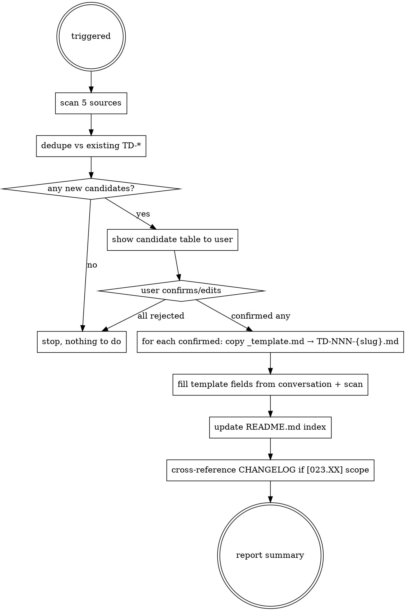

# Record Technical Debt

## Overview

Lifeware 项目已经积累大量技术债（CNUI 表单分叉、ISO 时间、overlap rule、undo 框架、lifecycle-configs require 债…），目前散落在 memory、plan、spec 里，无单一真相源。本 skill 是**每次 ship 末尾**的强制落库动作：把"本 PR 留下但没修的债"录入 `docs/tech-debt/`，跨版本可追溯。

## When to Use

**必须调起**：
- `/ship` 或 `/land-and-deploy` 的最后一个动作（船开走前盘点遗留）
- `/superpowers:finishing-a-development-branch` 末尾
- 完成一个 [023.XX] 大版本后回头扫描整个版本范围
- review pass 报告出现「ship-then-polish」「deferred」「known issue」「out of scope」关键词

**应当调起**：
- 用户在对话中提到「技术债 / TODO / FIXME / HACK / 先这样以后修 / 临时方案 / workaround / known limitation / defer」等
- 代码扫描到 `TODO` / `FIXME` / `HACK` / `XXX` / `TBD` 注释（且非本 PR 内即将解决的）

**不要调起**：
- 只是单纯解释代码（除非用户明确要求记录）
- 一次性需求（不是债，是任务）

## Data Sources（主动提取候选条目）

按优先级扫描，**每个源都要尝试**：

| 源 | 提取方式 |
|---|---|
| ① 当前会话上下文 | 提取本对话中所有「先这样 / 临时 / 后续 / defer / 搁置 / ship-then-polish / known issue」语句 |
| ② git diff (当前分支 vs main) | `git diff main...HEAD --stat` 看触及范围；`git log main..HEAD --oneline` 看每个 commit message 里的「fix / cleanup / polish」之外的显式遗留 |
| ③ 最近 review reports | 读 `~/.gstack/.../review-*.md`、`docs/superpowers/plans/*.md` 的「Defer / Known Issues / 遗留」段落、`docs/superpowers/specs/*.md` 的「Out of Scope」 |
| ④ 代码 TODO/FIXME 扫描 | `git diff main...HEAD \| grep -E "TODO\|FIXME\|HACK\|XXX\|TBD"` |
| ⑤ 已存在的 memory 债条目 | `grep -E "债\|debt\|tech.债" ~/.claude/projects/-home-walker-lifeware/memory/MEMORY.md` |

## Workflow



## Step-by-Step

### 1. 触发确认

回应用户调起时，先说：「正在扫描 5 个数据源提取本次 ship 的技术债候选…」

### 2. 扫描 + 提取候选

按 5 个源各跑一次，**输出一个统一的候选表格**（列：标题 / 候选严重性 / 候选领域 / 数据源 / 一句话根因）：

```
候选技术债清单（来自本会话 + diff + review + 代码扫描 + memory）

# | 标题 | 严重性 | 领域 | 来源 | 一句话根因
1 | ... | 🟠 | lifeware-tasks | ①③ | ...
2 | ... | 🟡 | lifeware-timebox | ④ | ...
```

### 3. 去重

跟 `docs/tech-debt/` 下所有已存在 TD 比对：
- 标题核心概念相同 → 标记为「已存在：[TD-NNN]，是否要更新其历史记录而非新建？」
- 完全不同的 → 保留为候选

### 4. 用户确认

向用户呈现：「以下 N 条候选，确认要录入几条？调整哪几条的严重性/类别？跳过哪几条？」

使用 AskUserQuestion（multiSelect）让用户勾选，并提供「编辑」选项让用户指定改动。

**用户拒绝某条时不要默默跳过**——问：是「不入库」，还是「降级为 Low/Trivial 但仍入库」？

### 5. 编号分配

- 读 `docs/tech-debt/` 下所有 `TD-NNN-*.md`，取最大 NNN + 1 作为新编号起点
- 编号永不重用：已关闭的 TD 编号保留
- 多条新债按用户确认顺序递增

### 6. 写入实例文件

每条确认的债：
1. 复制 `docs/tech-debt/_template.md` → `docs/tech-debt/TD-NNN-{slug}.md`
2. 填充元信息表 + 各小节；未知项明确写「未知」而不是留空
3. slug 用 kebab-case，英文优先；中文标题可以拼音首字母

### 7. 更新索引

更新 `docs/tech-debt/README.md`：
- 把新条目按状态分到对应表格
- 严重性分组合适的（🔴/🟠/🟡/🟢/⚪）
- 领域分组合适的

### 8. 交叉引用

- 如果本次 ship 是 [023.XX] 大版本收尾：在 `CHANGELOG.md` 的 `[023.XX]` 段落末尾追加「**遗留债 →** [[TD-NNN]] ×N」
- 如果有 spec/plan 涉及：在对应 spec/plan 加 `[[TD-NNN]]` 反向引用
- 如果命中已有 memory：在 memory 末尾加「**已入库：** [[TD-NNN]]」

### 9. 汇报

最终汇报格式：

```
✅ 已录入 N 条技术债：
- TD-001 · 🟠 · lifeware-tasks · 「xxx」 → docs/tech-debt/TD-001-xxx.md
- TD-002 · 🟡 · cross-domain · 「yyy」 → docs/tech-debt/TD-002-yyy.md

📋 已拒绝 K 条（不入库）：…
🔄 已合并 J 条到已有 TD：TD-005 已更新历史段
```

## Anti-Patterns（明确禁止）

| ❌ 反模式 | ✅ 正确做法 |
|---|---|
| 把模板写到 `mydocs/dev/`（用户只读） | 写到 `docs/tech-debt/` |
| 重用关闭的 TD 编号 | 全局递增，已关闭的不动 |
| 修复完成就把文件删了 | 保留全文，状态改 🟢 加关闭日期 |
| 用户拒绝候选就直接跳到下一条 | 询问「不入库」还是「降级录入」 |
| 跳过 ① ⑤ 数据源只跑 ②③ | 5 个源全跑，即使某源空结果 |
| 把"小问题"默认不入库 | 让用户判断，不是你判断 |
| 一次录入超过 10 条（信号太弱） | 拆成多次 ship 录入，或请用户细化 |
| 索引表格手写不维护 | 每次录入立刻更新 README.md |

## Common Mistakes

**Mistake 1**：用户在对话里说「这个先这样以后再说」，但你没记录。
→ 这是 ① 数据源的核心信号，必须捕获。

**Mistake 2**：你在 review 里指出 ship-then-polish 项，但没落库。
→ ship-then-polish 项就是典型的「先这样以后修」，必须落库。

**Mistake 3**：你看到代码里有 `// TODO: refactor this` 注释，但当前 PR 范围内没处理。
→ 这是 ④ 数据源，必须录入。

**Mistake 4**：你看到 memory 里有「⚠️横切技术债」段落，但没关联。
→ 这是 ⑤ 数据源，必须纳入。

**Mistake 5**：你以为"这次没技术债"就跳过整个流程。
→ 必须显式扫描 + 显式说「扫描完毕无候选」才算走完。

## Template

模板位置：`docs/tech-debt/_template.md`

不要修改模板结构，只填字段。如果发现模板字段不够用：
1. 先把当前债按现有字段尽量填完整
2. 在汇报里说：「发现模板 X 字段不够，建议追加 Z 字段」+ 给出建议
3. 等用户授权后再改模板

## Integration with Other Skills

- **`/ship`**：本 skill 是 `/ship` 的最后一步（push 之前）
- **`/superpowers:finishing-a-development-branch`**：合并前调起
- **`/plan-ceo-review`**：决策时读取 `docs/tech-debt/README.md` 作为优先级输入
- **`/plan-eng-review`**：技术债是评审报告的「已知债」段落主入口
- **`/office-hours`**：新需求 brainstorm 时主动 scan 本目录，避免重复造已知问题

## File Locations

```
docs/tech-debt/
├── _template.md         # 模板（不要重命名，下划线前缀表明非实例）
├── README.md            # 索引（每次录入必更新）
└── TD-NNN-{slug}.md     # 实例（NNN 永不重用）
```

`.claude/skills/record-tech-debt/SKILL.md` ← 本文件