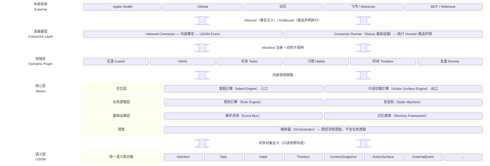

# Lifeware 总体设计 2026_02_27

------
**本文档说明**

本文档为 Lifeware 设计的**最高约束文件**，用于**统一 Lifeware 的设计边界、系统职责与不可违背的原则**。
它不是 PRD，也不是功能说明，而是所有子 App 设计、AI 行为、架构决策的**最高约束文件**。

注：本文档有部分是超前规划，其内容并非全部在 MVP 中实现，但是其约束也适合后续版本迭代。

关联文档：
- `LW_overall_技术栈设计演进.md`（技术栈选型与演进路径，不在本文档重复）
------


# 一、Lifeware 总体架构设计

## 1.1 设计原则（Design Principles）

### Local First 及隐私安全

- 本地数据库是 **唯一真实数据源（Source of Truth）**，如计划编排、时间盒手工调整、打卡等常用操作可离线执行
- 服务端数据库只是：
  - 同步中转站
  - 多端一致性保障
  - 备份与恢复工具
- 端到端加密（E2E），客户端持有主密钥，服务端仅存密文（MVP 阶段不实现）

### 连续性优先于模块清晰

- 任何设计都不得打断用户的"我现在在干嘛"
- 不允许出现需要用户**重新理解语境**的跳转

### 逻辑自治，物理统一

- Domain 在模型与规则上完全独立
- 表现层始终保持一个统一 App

### 意图驱动，而非功能驱动

- Lifeware 核心主页面，不是为了指示"使用功能"
- 而是为了**回应当下的一个模糊或明确的意图**，并引导用户进入相关功能，形成意图驱动

------

## 1.2 Lifeware 的总体框架

Lifeware 的四个层次：

- **USOM**（统一语义和对象层，Unified Semantic & Object Model）：是系统的底层基础，它不参与运作，只负责贯通全局的定义和规范
- **Nexus**（核心枢纽层）：是系统的大脑，作为系统的意识与语境枢纽，决定了"我是谁，现在是什么状态，可以做什么"
- **Domain Plugin**（领域插件层）：是外层可扩展器官（组件），包含在专业问题上的解决方案，只负责把领域内专职事做好，不能独立运作，是在 Nexus 支撑下运行的
- **Connector Layer**（连接器层）：是系统对外的桥梁，负责与外部数据源和外部服务的双向对接。Inbound Connector 将外部客观事实翻译为 USOM 事件注入系统；Outbound Connector 将 Domain 的推送意图投递到外部服务。**本层不在 MVP 中实现，接口预留。**

整体架构图如下：



------

# 二、语义层（USOM）设计规范

Unified Semantic & Object Model（USOM）是全系统的**共同语言**，定义了对象结构与生命周期，不含任何业务逻辑或执行规则。

## 2.1 USOM 规范原则

### 原则 1：对象先于能力（Object-before-Capability）

- Lifeware 的本质是数据驱动的应用
- 后续所有能力围绕对象设计

### 原则 2：USOM 只读快照（Read-Only Snapshot）的使用

- USOM 只读快照是 Domain 能够访问数据的唯一格式，Domain 不允许数据库连接或内部对象实现。

### 原则 3：语义版本演化机制

- **版本化：** USOM 需要支持版本管理，根据迭代需要有序扩容
- **兼容性策略：** 新版本如何向下兼容旧数据
- **废弃流程：** 如何安全地移除过时字段

## 2.2 核心对象类型

### 核心对象定义（Core Objects）

例如：

- status
- priority
- time_cost
- task
- habit
- timebox
- review
- context_snapshot（只读，由 State Machine 在每次状态变更后同步刷新）
- action_surface（Action Surface Engine 的输出对象）
- external_event（Inbound Connector 注入的外部事实，只读，不可被内部组件修改）
- external_payload（Domain.onOutboundRequest 的输出声明格式）

每个对象至少定义：

- 对象意图（Intent）
- 最小字段集
- 可参与的 Capability

### 对象生命周期约束

统一各类生命周期结果语义，例如：

- Task:     Draft → Active → Scheduled → Completed / Archived
- TimeBox:  Planned → Running → Paused → Ended → Logged
- Habit:    Draft → Active → Suspended / Archived

## 2.3 USOM 与 Nexus / Domain 的关系约定（治理条款）

- 所有 Nexus 组件的输入 / 输出对象，必须来自 USOM
- 所有 Domain 的提案、事件、行动，必须引用 USOM 只读快照

-----

# 三、核心层（Nexus）设计规范

## 3.1 Nexus 概述

### 一句话定义

Nexus 是 Lifeware 的运行时核心引擎，是系统中**唯一拥有执行权的层**。它协调意图、规则、状态与 Domain 之间的全部交互，统一决定何时调用哪个 Domain 的哪个钩子，并统一决定是否执行 Domain 返回的提案。

### 模块组成与分层

```
Nexus Layer
│
├── 交互层（用户面向，输入 / 输出）
│   ├── Intent Engine（意图引擎）          ← 唯一意图输入入口
│   └── Action Surface Engine（行动切面引擎）← 唯一输出出口
│
├── 业务逻辑层（编排与决策）
│   ├── Rule Engine（规则引擎）
│   └── State Machine（状态机）
│
├── 基础设施层（被动，无业务逻辑）
│   ├── Event Bus（事件总线）
│   ├── Memory Framework（记忆框架）
│   └── Connector Runner（连接器执行器）← 执行 Domain 的出站推送声明，不含业务逻辑
│
└── Orchestrator（编排器）
    └── 跨层流程调度，不含业务逻辑，不写状态，不参与 AI
```

**分层依赖原则**：上层组件依赖下层组件。Orchestrator 作为调度器，可跨层协调但不包含任何业务逻辑。

---

## 3.2 Orchestrator（编排器）

### 职责

Orchestrator 是 Nexus 内唯一负责**流程调度**的组件，根据不同场景构建各组件的合理链路。

- **链路调度**：根据触发场景，决定各组件的调用顺序
- **异常处理**：捕获链路上任意步骤的异常，执行重试 / 回滚 / 降级
- **人工决策暂停点**：Rule Engine 检测到冲突需人工确认时，Orchestrator 挂起执行链，等待用户响应后继续
- **场景编排**：为不同入口（对话输入 / 模板表单 / 时间触发）构建不同的执行链路

### 设计约束

- **不含任何业务逻辑**：不判断意图合法性，不生成提案，不参与 AI 调用
- **不写状态**：所有状态变更仍由 State Machine 执行
- **不参与 AI**：AI 调用由 Intent Engine 发起，Orchestrator 只等待结果

### 标准执行链

**意图驱动路径**（用户主动输入）：

```
用户输入（对话 / 模板表单）
    ↓ Orchestrator 启动链路
Intent Engine（AI 解析 + 澄清补全；AI 失败则降级为模板表单）
    ↓
Rule Engine（Domain.onValidate → 规则校验 + 冲突检测）
    ↓ 冲突时：Orchestrator 挂起，等待人工决策
State Machine（合法状态变更，唯一写入口；同步刷新 ContextSnapshot）
    ↓
Event Bus（广播事件 → 触发 Domain.onEvent → 收集指标与建议）
    ↓
Memory Framework（接收事件数据，写入分层记忆，更新 Derived Signals）
    ↓
Action Surface Engine（轮询 Domain.onActionSurfaceRequest → 排序 → 推送行动切面）
    ↓
Presentation（首页 Action Guide / Dynamic Tile / Continuity Cue）
```

**时间触发路径**（系统时间事件，无意图）：

```
时间事件（如 TimeBox 时间到）
    ↓ State Machine 自行捕捉，无需经过 Rule Engine
State Machine（状态变更；同步刷新 ContextSnapshot）
    ↓
Event Bus → Memory Framework → Action Surface Engine
```

---

## 3.3 Intent Engine（意图引擎）

系统的**唯一输入入口**，支持文字、语音识别转文字、附件、格式化模板表单输入。

### 职责

- **意图记录**：临时的模糊念头、各类明确 / 模糊的需求、情绪感受等均可记录
- **意图拆解**：将复杂意图拆解为多个简单意图，每个意图对应一个可落地的行动
- **意图生命周期**：Captured → Clarified → Routed → Dissolved
- **意图澄清**：读取 Domain manifest 中的 `required_fields`，由 Intent Engine 负责补全，不下沉到 Domain

### AI 降级策略（template-form fallback）

AI 解析是 Intent Engine 的默认路径，但必须定义明确的降级机制：

```
正常路径：用户自然语言输入 → AI 解析 → StructuredIntent
    ↓ AI 调用失败 / 超时 / 低置信度时
降级路径：展示结构化模板表单 → 用户手动填写 → StructuredIntent
```

降级触发条件：
- AI 调用超时（本地模型不可用 / 网络断开）
- AI 返回置信度低于阈值
- 用户主动选择模板输入（斜杠快捷操作 `/create_task` 等）

降级后的表单数据与 AI 解析结果产出相同的 `StructuredIntent` 结构，后续链路无感知。

### 特殊输入设计

1. **意图快捷操作**：类似 CLI 的斜杠触发模式，例如 `/create_task 新建项目`，可调出项目模板表单
2. **模板化表单**：用户通过快捷操作选择 Domain 定制的表单模板，通过界面输入

### 关联关系

- 依赖 Domain manifest：读取 `required_fields`
- 依赖 Memory Framework：读取近期会话、Derived Signals
- 后续驱动 Rule Engine（经由 Orchestrator）

---

## 3.4 Rule Engine（规则引擎）

系统的决策中心，负责规则校验，形成决策意见，在需要的时候触发人工决策。

### 职责

- **规则校验**：在意图提案进入 State Machine 之前执行合法性校验
- **通用冲突检测**：检查基本逻辑冲突，如时间冲突、能量冲突等
- **个性冲突检测**：根据 Memory Framework 的 Derived Signals，检查与用户习惯和过度承诺的冲突
- **决策报告**：生成决策报告及推荐的冲突解决建议
- **人工决策触发**：冲突不通过时，通知 Orchestrator 挂起链路，等待用户手动决策

### 与 AI 的边界

```
AI          → 生成意图 Proposal（模糊处理）
Rule Engine → 校验 Proposal 合法性（确定性处理）
State Machine → 执行合法变更（唯一写入口）
```

### 关联关系

- 被 Orchestrator 驱动（接收 StructuredIntent）
- 依赖 Domain.onValidate：触发领域规则校验
- 依赖 Memory Framework：读取 Derived Signals，用于个性冲突检测
- 输出 StateProposal → Orchestrator → State Machine

---

## 3.5 State Machine（状态机）

根据各触发条件，管理所有 USOM 对象的生命周期状态。

### 职责

- **状态管理**：根据触发条件变更各对象的生命周期，拒绝非法状态跃迁
- **创建对象**：根据决策意见创建 USOM 对象
- **刷新 ContextSnapshot**：每次状态变更后同步刷新 `ContextSnapshot`（定义在 USOM 层），刷新为同步操作，不做异步延迟
- **发布事件**：将状态变更情况推送给 Event Bus

### 触发条件分类

| 类型 | 来源 | 是否经过 Rule Engine |
|---|---|---|
| 意图驱动事件 | Orchestrator 送达的 StateProposal | 是，唯一路径 |
| 时间触发事件 | State Machine 自行捕捉（如 TimeBox 时间到） | 否，直接执行 |

**设计约束**：除以上两类，State Machine 不接受任何其他触发来源。Domain 和 AI 均不可绕过 Orchestrator 直接驱动 State Machine。

### ContextSnapshot 规范

- **定义位置**：USOM 层（只读对象）
- **生成主体**：State Machine，每次状态变更后同步更新
- **消费方**：Action Surface Engine、Rule Engine、Memory Framework
- **内容**：当前所有活跃对象的状态聚合，不含历史事件流

### 关联关系

- 被 Orchestrator 驱动（接收 StateProposal）
- 时间事件自行捕捉
- 写入 Event Bus（发布 StateChanged 事件）
- 同步刷新 ContextSnapshot（USOM 层只读对象）

---

## 3.6 Event Bus（事件总线）

Event Bus 是系统的广播频道，是跨模块通信的**唯一机制**。

### 职责

- 将状态变更打包为不可变事件
- 发布事件（驱动 Domain 的 `onEvent` 钩子）
- 支持基于 Event 的状态回滚、重放

### 设计约束

- Event 是不可变事实（What happened · When · By whom）
- Event Bus 本身**无业务逻辑、无状态**，只做广播
- Domain 的 `onEvent` 只能返回计算结果（指标、建议），不能触发状态变更
- Event Bus 不负责生成或维护 ContextSnapshot（由 State Machine 负责）

### 示例 Event

```
TimeBoxStarted  { timebox_id, started_at, task_ids }
TaskCompleted   { task_id, completed_at, duration }
HabitLogged     { habit_id, date, note }
ReviewCreated   { review_id, period, summary }
```

### 关联关系

- 被 State Machine 写入（接收 StateChanged 事件）
- 后续触发 Domain.onEvent
- 后续通知 Memory Framework（原始事件数据）

---

## 3.7 Memory Framework（记忆框架）

从短期到长期，构建五个层次的记忆框架（Unified Memory Framework），是实现用户个性化认知的基础。

### 结构

Unified Memory Framework = 分层记忆（Layered Memory）+ 记忆衍生信号（Derived Signals）

- **分层记忆**：跨时间尺度保存用户相关信息，对记忆进行分层、摘要与访问控制，从底层短期记忆逐步自动提炼沉淀到长期记忆
- **Derived Signals**：预先计算、压缩、脱敏后的信号（自动生成，可维护），为各模块提供决策依据

### 写入控制（关键约束）

**Memory Framework 是单一写入口。外部组件不得直接写入 Memory Framework，只能通过 Memory Framework 暴露的 API 发送原始数据请求，由 Memory Framework 自身决定如何存储。**

```
✓ 正确：State Machine 调用 memoryFramework.record(event_data)
✓ 正确：Event Bus 通知后，Memory Framework 自行提取信息
✗ 禁止：State Machine 直接写入 Memory Framework L1 层
✗ 禁止：Event Bus 直接向 Memory Framework 写入派生指标
```

### 分层记忆（Layered Memory）

| 层级 | 内容 | 生命周期 |
|---|---|---|
| L1 Session Layer | 会话层：保存对话上下文内容 | 分钟/会话 |
| L2 Episode Layer | 情境层：近期行为摘要、决策、偏差 | 天/周 |
| L3 Procedural Layer | 行为层：行为模式、执行倾向、稳定习惯特征 | 周/月 |
| L4 Semantic Layer | 认知层：思维模式、决策框架、心智模型 | 月/年 |
| L5 Core Layer | 核心层：长期偏好 / 模式 | 长期/人工维护 |

### 维护规范

- L1 自动管理（超出会话轮次的记忆，自动摘要）
- L2-L4 自动生成，可由人工维护
- L5 必须人工维护

### Derived Signals 设计约束

低语义、可量化、可回溯原则。Signal 不应包含原始文字内容，只包含经过计算的数值或枚举型标签。

```
✓ 允许：{ energy_pattern: "morning_peak", confidence: 0.82 }
✓ 允许：{ habit_streak: 12, completion_rate_7d: 0.71 }
✗ 禁止：{ recent_reflection: "用户最近感到工作压力较大..." }
✗ 禁止：{ last_review_summary: "本周完成了3个目标..." }
```

### 共享原则

- 各模块可读取 Derived Signals
- 除 L1 会话层记忆外，其他分层记忆不对外共享

### 触发机制

- 定时触发：根据时间窗口（天、周、月）自动生成摘要
- 事件触发：响应 Event Bus 广播
- 手工触发：用户手动请求摘要、调整偏好等

---

## 3.8 Action Surface Engine（行动切面引擎）

原 Dynamic Tile Engine，升级为 Action Surface Engine，是系统的**唯一输出出口**，体现"意图驱动"的核心设计理念。

### 职责

- 根据 ContextSnapshot + 优先级算法，将抽象行动候选转化为可执行的行动切面
- 管理三类行动切面的生成与展示策略
- 轮询各 Domain 的 `onActionSurfaceRequest`，统一排序后输出

### 三类行动切面

```
Action Surface Engine
├── Action Guide（行动指南）
│   ├── 定位：未来价值最高的重要事项提示，帮助用户始终回到关键目标
│   ├── 来源：OKR / 目标域提供的高优先级候选
│   ├── 展示：首页显著位置常驻展示，可通过快捷方式随时调出
│   └── 频率：低频刷新，不随每次操作变化
│
├── Dynamic Tile（动态磁贴）
│   ├── 定位：当下立即可执行的行动，执行后即消失
│   ├── 来源：当前任务 / 习惯状态
│   ├── 展示：首页，一般不超过 3 个，立即可点击
│   └── 频率：高频刷新，随状态变化实时更新
│
└── Continuity Cue（连续性提示）
    ├── 定位：折叠的待处理项队列，避免积累过多磁贴造成认知过载
    ├── 可执行操作：忽略（降级）/ 继续 / 暂停
    └── 频率：按需展示
```

**Action Guide 是重要的常驻元素**，不应被折叠或隐藏，用户每次打开应用时应在显著位置看到当前最重要的事项，这是让用户始终回到关键事情的核心机制。

### 交互范式

- Lifeware 不要求用户"找到功能"，而是主动在合适的情境下提供可立即执行的行动机会
- 系统的价值体现在：**用户在每一个情境下，是否知道下一步该做什么**

### 生成逻辑

```
ContextSnapshot + 当前时间 + 优先级算法 + 精力情况
    → 轮询各 Domain 的 onActionSurfaceRequest，收集候选与建议权重
    → 统一排序，计算"此时此刻用户最需要看到什么"
    → 分类渲染：Action Guide / Dynamic Tile / Continuity Cue
```

### 设计约束

- **关键边界**：Domain 只提供候选和分类建议，**Action Surface Engine 决定最终展示什么**。Domain 不决定何时显示，不决定优先级。
- Dynamic Tile 当下可点击一般不超过 3 个
- 不允许作为"导航入口"
- 不允许跳转到列表页
- MVP 阶段：手写 Core 侧排序规则，不过早 AI 化

### 关联关系

- 依赖 ContextSnapshot（由 State Machine 维护，USOM 层只读对象）
- 依赖 Memory Framework：读取 Derived Signals（精力历史、未完成任务等）
- 依赖 Domain.onActionSurfaceRequest：收集行动候选

---

## 3.9 Connector Layer（连接器层）

Connector Layer 是 Lifeware 对外的桥梁，**不在 MVP 中实现，接口预留**。分为 Inbound 和 Outbound 两个方向，各自职责严格分离。

### Inbound Connector（入站连接器）

**职责**：将外部客观事实翻译为 USOM 格式事件，注入系统内部。

**设计约束**：
- Inbound Connector 是独立薄层，不属于 Nexus 内部，不含任何业务逻辑
- 只负责格式翻译和事件投递，不做任何判断
- 外部数据按语义分三条路径进入系统，不得混用：

| 外部数据类型 | 语义 | 进入目标 |
|---|---|---|
| Apple Health 步数、GitHub Commit 等 | 已发生的客观事实 | Event Bus（如 HabitDataReceived） |
| 日历事件导入 | 已计划的时间结构 | Orchestrator → State Machine |
| 飞书机器人消息、快捷指令等 | 用户主动意图 | Intent Engine |

**数据流**：

```
外部数据源（Apple Health / GitHub / 日历 / 飞书）
    ↓
Inbound Connector（格式翻译 → ExternalEvent，USOM 格式）
    ↓
Event Bus / Orchestrator / Intent Engine（按语义分流）
```

### Connector Runner（出站执行器，位于 Nexus 基础设施层）

**职责**：接收 Domain.onOutboundRequest 返回的推送声明，执行实际的外部 IO 调用。

**设计约束**：
- Connector Runner 是 Nexus 基础设施层的薄模块，无业务逻辑
- 不决定推什么、什么时候推——这些由 Domain 的 `onOutboundRequest` 声明
- 只负责：查找已注册的 Connector 实现 → 执行 HTTP/SDK 调用 → 处理重试 / 超时 / 鉴权

**数据流**：

```
Event Bus 广播事件
    ↓
Domain.onOutboundRequest（纯函数，返回推送声明，不执行 IO）
    ↓
Connector Runner（执行实际 IO：HTTP / SDK / Webhook）
    ↓
外部服务（飞书 / Apple Shortcuts / MCP / Webhook）
```

---

## 3.10 Nexus 组件关系总结

### 完整依赖图

```
用户输入
    │
    ▼
┌─────────────────────────────────────────┐
│           Intent Engine                  │
│  ◀── Memory Framework（L1 会话 + Derived Signals）
│  ◀── Domain manifest（required_fields）  │
│  ◀── Inbound Connector（用户意图类外部输入）
│  AI 失败 → template-form fallback        │
└────────┬────────────────────────────────┘
         │ StructuredIntent
         ▼ Orchestrator 调度
┌─────────────────────────────────────────┐
│           Rule Engine                    │
│  ◀── Memory Framework（Derived Signals）│
│  ◀── Domain.onValidate（领域规则）       │
│  冲突 → Orchestrator 挂起 → 人工决策     │
└────────┬────────────────────────────────┘
         │ StateProposal（Orchestrator 传递）
         ▼
┌─────────────────────────────────────────┐
│           State Machine                  │
│  ◀── Inbound Connector（时间结构类外部输入，经 Orchestrator）
│  ──▶ Event Bus（发布 StateChanged）      │
│  ──▶ ContextSnapshot（同步刷新，USOM层） │
└─────────────────────────────────────────┘
         │ Event Bus 广播
         │ ◀── Inbound Connector（客观事实类外部输入直接注入）
         ▼
┌─────────────────────────────────────────┐
│           Memory Framework               │
│  接收事件原始数据，自主决定写入策略       │
│  ◀── Domain.onEvent（返回指标与建议）    │
│  自动生成 Derived Signals                │
└─────────────────────────────────────────┘
         │
         ▼
┌─────────────────────────────────────────┐
│        Action Surface Engine             │
│  ◀── ContextSnapshot（USOM 只读快照）   │
│  ◀── Memory Framework（Derived Signals）│
│  ◀── Domain.onActionSurfaceRequest      │
│       → Action Guide（常驻显著位置）    │
│       → Dynamic Tile（立即可执行）      │
│       → Continuity Cue（折叠队列）      │
└─────────────────────────────────────────┘

Event Bus 广播同时触发出站路径：
         │
         ▼
┌─────────────────────────────────────────┐
│  Domain.onOutboundRequest（纯函数声明）  │
│  返回：connector + payload + condition   │
└────────┬────────────────────────────────┘
         │ 推送声明
         ▼
┌─────────────────────────────────────────┐
│        Connector Runner                  │
│  执行实际 IO → 飞书 / Shortcuts / MCP   │
└─────────────────────────────────────────┘
```

### 完整交互流程示例

**用户说："我想每天早上跑步，作为健康目标的一部分"**

```
① 用户输入（自然语言对话框）
    ↓
② Intent Engine（AI 解析）
   → 识别两个意图：CreateHabit + GoalLink
   → 提取：name=跑步, frequency=daily, time_hint=早上
   → 读取 habit manifest.required_fields，发现缺少：时间点、时长、start_date
    ↓
③ 澄清推送
   → "好的，已关联健康目标。跑步几点开始？打算跑多久？从哪天开始？"
    ↓
④ 用户补全："7点，30分钟，下周一"
    ↓
⑤ StructuredIntent 构造完成 → Orchestrator 路由到 Rule Engine
    ↓
⑥ Rule Engine 调用 Habit.onValidate(intent, snapshot)
   → Habit Domain 返回：{ valid: true }
   → Rule Engine 自身检查时间冲突：发现周二早上有 TimeBox
   → Orchestrator 挂起链路，提示用户："周二早上有冲突，建议调整为晚上或跳过"
    ↓
⑦ 用户确认后，Orchestrator 恢复，State Machine 执行
   → 创建 Habit 对象（写入 USOM）
   → 状态：Draft → Active
   → 同步刷新 ContextSnapshot
   → Event Bus 发布：HabitCreated { habit_id, ... }
    ↓
⑧ Memory Framework 接收 HabitCreated 事件
   → 调用 Habit.onEvent(HabitCreated, snapshot)
   → Habit Domain 返回：{ metrics: [streak_reset], suggestions: [...] }
   → Memory Framework 处理并写入 Derived Signals
    ↓
⑨ Action Surface Engine 根据新 ContextSnapshot 刷新
   → 调用 Habit.onActionSurfaceRequest(snapshot)
   → Habit Domain 返回候选 + 分类建议 + 权重
   → Action Guide 更新：[健康目标：每日跑步 ← 下周一开始]
   → Dynamic Tile 推送：下周一早上 [7:00 跑步打卡] [跳过今天] [延后15分钟]
    ↓
⑩ 日报生成时
   → AI 读取 HabitLogged Events → 生成今日完成情况 → 用户可补充编辑
```

---

# 四、Domain Plugin 的设计规范

## 4.1 核心定义

**Domain 是一组声明式规则与纯计算函数/算法的集合，是被动规则集，不是主动执行单元。** 只能被 Nexus 在固定时机通过钩子调用。

## 4.2 能力边界（四能 · 三禁）

**Domain 具备的四种能力：**

1. 通过 manifest 声明它关心的对象类型与结构完整性约束
2. 对意图提案进行合法性校验（`onValidate`）
3. 响应事件，返回派生指标与建议（`onEvent` / `onActionSurfaceRequest`）
4. 声明出站推送意图（`onOutboundRequest`，可选）——返回推送声明，由 Connector Runner 执行实际 IO

**Domain 的三条禁令：**

1. **不能写入状态**——所有状态变更归 State Machine，Domain 只返回提案
2. **不能主动运行**——Domain 只能被 Core 调用，无法自行触发任何逻辑
3. **不能访问其他 Domain 的内部数据**——只接收 USOM 格式的只读快照

---

## 4.3 统一插件接口：四钩子模型

```typescript
DomainPlugin {

  // 注册接口（唯一与 Core 沟通的界面）
  manifest.yaml

  // 钩子一：意图校验
  onValidate(
    intent: StructuredIntent,
    snapshot: USOMSnapshot          // 只读，USOM 格式
  ) → { valid: bool, errors: string[] }

  // 钩子二：事件响应
  onEvent(
    event: SystemEvent,
    snapshot: USOMSnapshot          // 只读，USOM 格式
  ) → { metrics: MetricUpdate[], suggestions: ActionSurfaceSuggestion[] }

  // 钩子三：行动切面候选
  onActionSurfaceRequest(
    snapshot: USOMSnapshot          // 只读，USOM 格式
  ) → {
    actions: ActionCandidate[],          // 候选行动列表
    category: 'guide' | 'tile' | 'cue', // 分类建议（Action Surface Engine 可覆盖）
    weight: number
  }

  // 钩子四：出站推送声明（可选，MVP 不实现）
  onOutboundRequest(
    trigger: SystemEvent,           // 由哪个事件触发
    snapshot: USOMSnapshot          // 只读，USOM 格式
  ) → {
    connector: string,              // 目标连接器 ID（如 'feishu' / 'apple_shortcuts' / 'webhook'）
    payload: ExternalPayload,       // 推送内容声明，Domain 只管格式，不执行 IO
    condition?: string              // 可选：触发条件表达式
  }

}
```

**四个钩子的关键设计点：**

- 输入永远是 `USOMSnapshot`（只读快照），Domain 看不到数据库连接、ORM、事件总线引用——这是耦合隔离的物理边界
- 输出永远是声明，不是执行——`suggestions` 是候选，`metrics` 是计算结果，`payload` 是推送意图，Core 决定是否采纳和如何执行
- **钩子四严格保持纯函数**：`onOutboundRequest` 只返回声明性结构，实际 HTTP 调用、鉴权、重试全部由 Connector Runner 承担，Domain 不感知外部 SDK
- 函数签名固定，第三方开发者只需理解这四个签名，无需了解 Core 内部实现

---

## 4.4 Manifest：唯一注册界面

内容包括：

- 声明处理哪些意图
- 结构完整性契约（`required_fields`）
- 订阅哪些事件（只能响应，不能触发状态变更）
- 行动切面候选模板（含分类：guide / tile / cue）
- 无 AI 兜底配置模板
- 出站连接器声明（`outbound_connectors`，可选，MVP 不实现）：声明支持哪些出站目标及其触发事件
- 入站数据源声明（`inbound_sources`，可选，MVP 不实现）：声明可消费哪些外部数据源，未配置时降级为内部手动输入

```yaml
# 示例：habit-domain/manifest.yaml（Connector 相关部分）
outbound_connectors:
  - id: feishu_bot
    trigger: HabitStreakMilestone   # 哪个事件触发出站
    optional: true                  # 用户未配置此 connector 时跳过

inbound_sources:
  primary: lifeware_internal        # 用户无外部工具时，使用 Lifeware 内置打卡
  connectors:
    - apple_health_steps            # 有 Apple Health 时，自动读取步数
    - strava_activities             # 有 Strava 时，自动读取跑步记录
  fallback: manual_input            # 以上均不可用时，手动打卡
```

Nexus 读取 manifest 完成全部注册。**Domain 代码本身对 Nexus 的存在一无所知。**

---

## 4.5 Domain 内部文件结构

```
/habit-domain
  manifest.yaml         ← 唯一注册界面（含 outbound/inbound connector 声明）
  handlers/             ← 纯函数，零 Core 依赖
    create.js           ← onValidate 实现
    log.js
    skip.js
  rules/                ← 校验规则（供 Rule Engine 加载）
    frequency.js
    streak.js
  connectors/           ← 出站推送声明（MVP 不实现，接口预留）
    feishu.js           ← onOutboundRequest 实现：返回飞书消息格式声明
    shortcuts.js        ← onOutboundRequest 实现：返回 Apple Shortcuts payload 声明
  knowledge/            ← AI Prompt 模板、方法论、分类规则
    prompts.yaml
    methodology.md
  schema/               ← 对 USOM 对象的领域扩展字段（可选）
    habit.schema.json
  tests/                ← 完全独立的单元测试，无需 Mock Core
    create.test.js
    connectors.test.js  ← connector 声明函数的纯函数测试，无需 mock HTTP
```

`tests/` 可以在没有 Core 的情况下完整运行，因为 Handler 是纯函数——这是低耦合的直接体现。

---

## 4.6 当前 Domain 及扩展路径

| 阶段 | Domain |
|---|---|
| MVP | OKRs · Tasks · Habits · TimeBox · Review |
| 扩展 | Project · Health · Career · Interest |

**扩展新 Domain**：实现四钩子函数（钩子四可选）+ 编写 manifest + 注册到 Core，无需改动 Core 代码。

---

# 五、关于智能决策架构

## 5.1 AI 参与的位置

- **Intent Engine**：意图解析、澄清问题生成；AI 失败时降级为模板表单
- **Presentation**：日记生成、复盘报告撰写
- **Domain Plugin**：领域特定的内部 AI 逻辑，通过函数调用返回结果

## 5.2 AI 不参与的位置

- 规则校验（Rule Engine 纯规则执行）
- 状态变更（State Machine 控制）
- 行动切面优先级排序（MVP 阶段手写规则）
- 时间冲突判断（确定性逻辑）

> **原则：AI 处理模糊性，规则处理确定性。AI 只生成 Proposal，不直接写入系统状态。**

---

# 六、本文档的使用方式

- 本总体设计优先级高于任何 PRD
- 所有新功能必须能指出其所在模块与合法边界
- 一切争议设计，回到本总体设计裁决

> **如果一个设计无法被本文档清楚解释，它就是不合法的设计。**

------
