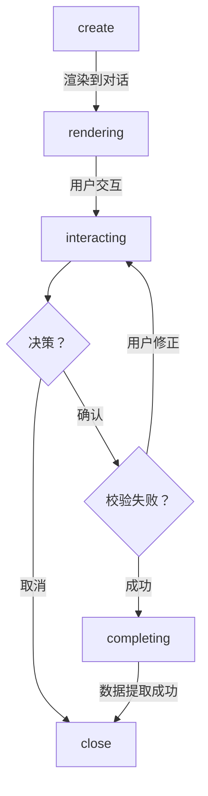

# AI Runtime 架构设计

> 本文档是 Lifeware AI Runtime 的完整架构设计文件，涵盖：
>
> - AI Runtime 基础设施（LLMGateway / SessionManager / TokenBudget / Cache）
> - CN-UI（Conversation Native UI）协议设计
> - Context Engine 扩展
> - Manifest 扩展规范
> - 完整执行链路
>
> 文档版本：V3.0 | 编制日期：2026-05-20 | 密级：内部公开
>
> 关联文档：总体设计 | 技术栈演进 | USOM | Domain 注册指南

---


---

## 1 执行摘要

本文档为 Lifeware 系统的 **AI Runtime 架构设计**，旨在为 App 中所有 AI 应用提供统一、可扩展、可持续演进的基础架构。同时解决 AI 对话体验割裂的核心痛点—通过 CN-UI Protocal Stack（Conversation Native UI，类似 谷歌的A2UI，Agent-to-User Interface）让 AI 在对话流中直接生成原生交互界面， 替代传统的表单跳转和 Markdown 编辑模式。

### AI Runtime 的定位

是 Nexus 核心层的新增基础设施子系统，AI Runtime 不是业务组件，不感知任何 Domain 业务逻辑。它只负责一件事：**将 Nexus 组件的 AI 调用请求高效、可靠、经济地路由到合适的 LLM，并管理好调用过程中的 Session、Token、Cache 、Memory 和 CN-UI Surface。**

### 核心设计决策

- **判断1：技术栈**。保持 TypeScript 单体架构，采用 Vercel AI SDK 作为 AI 调用层，不引入 Python 后端，MVP 阶段不引入 LangGraph
- **判断2：统一与自治**。AI Runtime 统一管理 Session、Token、Cache、模型路由；Domain Handler 自治管理编排逻辑和 Prompt 设计。AI Runtime 通过依赖注入供 Handler 内部调用（`onGenerate` hook），不是 Orchestrator 与 Handler 之间的中间层
- **判断3：CN-UI（Conversation Native UI）Protocol**。CN-UI 是 Payload 协议，不是 UI 框架，其原理是引入 Google 类A2UI 协议思路，构建 Lifeware 的声明式 UI 协议层，AI 在对话中直接渲染交互组件
- **判断4：Streaming 策略**。纯文本生成场景使用流式响应（streaming），CN-UI 场景关闭 streaming 使用非流式调用（`generate()`）。CN-UI Payload 是结构化 JSON，流式输出中间态不可解析；前端用 loading 动画覆盖 2-5 秒等待
- **判断5：Prompt 管理**。MVP 阶段不引入 PromptTemplate Registry，Handler 直接在 .ts 文件中内联 systemPrompt 和 Zod Schema。Registry 在超过 5 个 Domain 使用 AI 生成、或需要在线热更新 prompt 时再引入
- **判断6：会话管理**。在 Domain manifest 中新增 `session_mode` 声明，由 Session Manager 统一管理活跃会话，AI Session 直接映射到 Memory Framework L1 Session Layer，对话历史自动沉淀到长期记忆
- **判断7：上下文组装**。Context Engine 负责外部数据，AI Runtime 负责 Session 内信息，两者在 Handler 调用前合并


## 2 现状分析与需求解读

### 2.1 现有 AI 能力现状

根据总体设计文档（2026-05-02 版），Lifeware 当前已具备以下 AI 相关能力：

| 能力 | 位置 | 现状 | 不足 |
|------|------|------|------|
| 意图解析（路由+字段补全） | Intent Engine | 两阶段处理模型已定义 | AI 降级策略已设计，待实现 |
| 一次性对话生成 | Intent -> Rule -> State Machine | 可生成时间盒/任务/习惯 | 仅单轮，无 Session 管理 |
| AI 生成方案（Generative Path） | Handler + Context Engine | 架构已定义，接口已设计 | 无 AI Runtime 统一管理 |
| Memory Framework | L1-L5 分层记忆 | 架构已定义 | 未与 AI 对话系统整合 |

### 2.2 业务场景需求分析

根据产品需求，AI 应用场景分为三大类：

| 场景类别 | 具体场景 | Session 模式 | 上下文需求 |
|----------|----------|-------------|-----------|
| 生成建议/总结 | 生成一天的时间盒事件 | single_round | 任务+习惯+OKR+能量状态 |
| 生成建议/总结 | 生成每日总结（柳比歇夫日记） | multi_turn | 当日所有事件+历史模式 |
| 生成建议/总结 | 生成下一周期 OKR 建议 | multi_turn | 上期 OKR+任务完成+长期目标 |
| 生成建议/总结 | 生成 OKR 总结 | single_round | 周期内 KR 进度+关键事件 |
| 生成建议/总结 | 生成周深度复盘总结 | multi_turn | 周事件+能量数据+习惯 streak |
| 上下文信息供给 | 外部信息组装 | — | manifest 声明 + Context Provider |
| 上下文信息供给 | Session 内信息 | — | 同 Session 历史 Proposal |
| 多轮对话 | 生成结果的二次修正 | multi_turn | 当前 Session 全部历史 |


### 2.3　CN-UI 场景需求

当前 AI 助手存在体验割裂问题：当用户输入不完整时，系统要么跳转 UI 表单，要么引导到 Markdown 模板，打断了对话的连续性。CN-UI 解决了这一痛点。

#### 场景一：习惯创建（参数补全型 CN-UI）

用户在 AI 助手中输入"我要养成跑步的习惯"：

| 维度     | 传统方式（割裂体验）           | CN-UI 方式（对话内闭环）                           |
| :------- | :----------------------------- | :------------------------------------------------- |
| 系统响应 | "好的，请填写习惯表单（跳转）" | 在对话框中直接渲染习惯创建卡片                     |
| 信息补全 | 跳转到独立表单页面填写         | 名称已预填"跑步"，用户在卡片中选择时间、时长、频率 |
| 确认提交 | 表单提交后回到对话             | 点击卡片内"确认"按钮，直接在对话流中完成           |
| 体验评价 | 上下文丢失，对话断裂           | 对话连续，所见即所得                               |

#### 场景二：时间盒计划生成（复杂交互型 CN-UI）

用户说"生成今日的时间盒计划"，AI 生成十几条任务的列表清单：

| 维度     | 传统方式               | A2UI 方式                                |
| :------- | :--------------------- | :--------------------------------------- |
| 生成结果 | Markdown 文本列表输出  | 对话内渲染可交互的时间盒列表 CNUISurface |
| 用户调整 | 需要编辑 Markdown 文件 | 直接拖拽调整任务顺序和时间段             |
| 实时反馈 | 编辑后重新提交         | 拖拽时实时显示时间冲突提示               |
| 确认提交 | 保存文件 → 触发同步    | 点击"确认创建"→ 直接写入系统             |


### 2.4 设计约束与原则

AI Runtime 的设计必须遵循 Lifeware 总体设计文档中定义的以下约束：

1. **Local First**：本地数据库是唯一真实数据源；AI Runtime 不得绕过 Repository 直接访问数据库
2. **逻辑自治，物理统一**：Domain 在模型与规则上完全独立；AI Runtime 作为统一物理基础设施服务于所有 Domain
3. **意图驱动，而非功能驱动**：AI Runtime 不主动发起任何操作，只响应 Handler 或 Intent Engine 的请求
4. **AI 处理模糊性，规则处理确定性**：AI Runtime 只生成 Proposal，不直接写入系统状态
5. **安全优先**：CN-UI 是声明式数据协议，不是可执行代码；Agent 只能引用 Domain 预定义组件目录中的组件
6. **对话闭环**：CN-UI 交互必须在对话流内完成，不跳转到独立页面


---

## 3 AI Runtime 总体架构

### 3.1 统一与自治的边界划分

经过对多种架构模式的评估，最终采用 **"统一 Runtime + 自治 Handler"** 混合模式。

#### 3.1.0 架构定位：依赖注入，非中间层

**核心决定**：AI Runtime 是 Handler 内部通过依赖注入使用的基础设施，不是 Orchestrator 与 Handler 之间的中间层。

```
Orchestrator（路由调度，不直接调用 AI）
  ├─ Reactive Path  → Handler.onIntent(intent)              // 现有路径，不变
  ├─ Generative Path → Handler.onGenerate(request, aiRuntime) // 新增 hook，AI Runtime 注入
  └─ Time Trigger    → （尚未开发）
```

**关键约束**：
- **Orchestrator 只管"走哪条路"**：识别意图类型、协调 Context Engine 和 Session Manager 等组件，但不关心 AI 怎么调、调什么模型
- **Handler 拥有 AI 调用的完整自主权**：通过注入的 `aiRuntime` 参数决定调几次、用什么参数、是否用工具、是否用 CN-UI
- **onIntent 签名不变**：现有 Reactive Path 的 `onIntent` hook 保持不变；Generative Path 通过新增的 `onGenerate` hook 进入
- **AI Runtime 对 Handler 是基础设施**：类似于 Handler 对 Context Engine 的关系——Handler 使用它，但不被它控制

#### 3.1.1 统一由 AI Runtime 管理的内容

| 职责 | 说明 | 理由 |
|------|------|------|
| Session 生命周期管理 | 创建、激活、挂起、关闭 Session；活跃会话锁定 | 防止并发冲突；统一跟踪对话状态 |
| Token 预算与计量 | 预估、预算分配、超限处理、费用统计 | 成本控制；防止单次调用过大 |
| LLM Provider 抽象 | 统一接口调用 OpenAI/Anthropic/Ollama 等 | Domain 不感知底层模型差异 |
| 模型路由 | 按任务类型/成本/质量要求路由到不同模型 | 成本优化；本地优先 |
| 通用 Cache 层 | 语义缓存、Prompt 前缀缓存、结果缓存 | 减少重复调用；降低成本和延迟 |
| 对话历史存储 | 读写 Session 内消息历史 | 与 Memory Framework L1 整合 |
| 工具调用基础设施 | 工具注册、Schema 生成、调用执行 | 统一工具管理；安全性控制 |
| CN-UI Protocol Stack | CNUISurface 管理、组件目录、事件回传、渲染协调 | 统一对话内 UI 能力；安全控制 |

#### 3.1.2 由 Domain/Handler 自治管理的内容

| 职责 | 说明 | 理由 |
|------|------|------|
| Generative Path 编排 | `onGenerate` hook 内的完整编排逻辑 | Handler 决定如何组织 AI 调用 |
| 编排逻辑 | 如何组织 prompt、是否多步调用、何时使用工具 | 不同 Domain 策略差异极大 |
| Prompt 模板设计 | 系统提示、用户提示、少样本示例 | Domain 专业知识需要自治表达 |
| Tool 定义 | Handler 需要哪些工具、工具参数定义 | Domain 决定需要调用的能力 |
| CN-UI 内容定义 | CNUISurface 中应包含哪些组件、数据如何绑定 | Domain 决定需要展示和交互的内容 |
| 结果校验 | AI 生成结果的领域合法性校验 | Rule Engine 只校验通用规则 |
| 降级策略 | AI 失败时退化为规则/模板的具体逻辑 | Domain 最了解如何降级 |

#### 3.1.3 Orchestrator 的 Generative Path 调度职责

Orchestrator 在 Generative Path 中承担**纯调度角色**，不直接调用 AI。

**与现有代码的关系**：当前 Orchestrator 已实现 Generative Path 的基础流程（`executeIntent` 中 `generation_actions` 检测 → `assembleContext` → `handler.handle()`）。扩展点是将 `handler.handle(generationRequest)` 变更为 `handler.onGenerate(generationRequest, aiRuntime)`，并新增 Session 准备逻辑。

**完整调度步骤**：

| 步骤 | 说明 | 对应现有代码 |
|:-----|:-----|:-------------|
| 1. 路径识别 | 检查 `manifest.generation_actions[action]` 是否存在 | 已实现 |
| 2. Context Engine 组装 | `assembleContext(intent, manifest)` 组装外部上下文 | 已实现 |
| 3. Session 准备（新增） | 若 `session_mode === 'conversational'`，向 Session Manager 获取/创建 Session | 待扩展 |
| 4. AI Runtime 注入（新增） | 将 `aiRuntime` 实例作为第二参数传给 Handler | 将 `handle(req)` 改为 `onGenerate(req, aiRuntime)` |
| 5. Handler 调用 | Handler 自主调用 `aiRuntime.generate()` / `aiRuntime.stream()` | 已有 handle，需改名 |
| 6. 结果流转 | 接收 Proposal / CN-UI Payload，写入 SystemEvent，返回前端 | 已实现 |
| 7. 异常处理 | Handler 异常时记录错误上下文，返回降级提示 | 已实现 |

> **Orchestrator 不做什么**：不调用 `aiRuntime.generate()`、不组装 prompt、不选择模型、不管理对话历史。这些全部由 Handler 内部自治。

### 3.2 AI Runtime 组件全景

AI Runtime 由 6 个核心组件构成（MVP），全部位于 Nexus 基础设施层：

```
+------------------------------------------------------------------+
|                         Orchestrator                               |
|  Reactive Path ──→ onIntent()                                     |
|  Generative Path ──→ onGenerate(request, aiRuntime) ─────────┐    |
|  Time Trigger ──→ (TBD)                                      |    |
+------------------------------------------------------------------+
                                                               │
  ┌────────────────────────────────────────────────────────────┘
  │  Handler 内部调用（依赖注入）
  v
+------------------------------------------------------------------+
|                    Domain Handler                                  |
|  Handler 通过注入的 aiRuntime 参数自主调用：                      |
|    aiRuntime.generate() / .stream()                               |
|    aiRuntime.sessions / .budget / .cache                          |
+------------------------------------------------------------------+
                     │
                     │ AI Runtime（基础设施，Nexus 层）
                     v
+------------------------------------------------------------------+
|  LLMGateway  SessionManager  TokenBudgetManager                   |
|  CacheManager  ToolExecutor  CNUIProtocol                         |
+------------------------------------------------------------------+
                     │
                     v
+------------------------------------------------------------------+
|         模型层/UI层                                                |
|   OpenAI    Anthropic    Ollama(Local)    CN-UIRenderer           |
+------------------------------------------------------------------+
                     │
                     v
+------------------------------------------------------------------+
|         数据层                                                     |
|   MemoryFramework L1      AI Cache Store                          |
|   CNUISurface Store                                               |
+------------------------------------------------------------------+
```

---

## 4 技术栈决策

### 4.1 核心选型：Vercel AI SDK

经过对当前主流 AI 框架的深度调研，选择 **Vercel AI SDK** 作为 Lifeware AI Runtime 的核心调用层。

| 特性 | 说明 | Lifeware 收益 |
|------|------|-------------|
| TypeScript 原生 | 完整类型支持，与 Next.js 深度整合 | 无需跨语言调用，类型安全 |
| 统一 Provider 接口 | 一套 API 调用 OpenAI/Anthropic/Google/Ollama 等 | 模型切换无代码改动 |
| Tool Calling | 原生支持工具定义、调用、结果回传 | Handler 可直接定义和使用工具 |
| Streaming | 内置流式响应支持 | 纯文本场景实时展示；CN-UI 场景关闭 streaming，非流式调用 |
| 轻量级 | 无复杂抽象，调试友好 | 降低学习和维护成本 |

### 4.2 为什么不是 LangGraph

LangGraph 是优秀的 Python Agent 编排框架，但不适合 Lifeware 当前阶段：

| 维度 | LangGraph 现状 | Lifeware 需求 | 结论 |
|------|-------------|-------------|------|
| 语言生态 | Python 为主，TypeScript 版本较新 | TypeScript 全栈 | Python 版本需要单独服务 |
| 架构复杂度 | 图编排、持久化、人机交互等完整能力 | MVP 阶段以简单调用为主 | 能力过剩，引入成本高 |
| 调试性 | 抽象层次深，调试困难 | 需要快速定位和修复问题 | 影响开发效率 |
| 部署成本 | 需要独立运行时 | 与 Next.js 同进程运行 | 增加运维复杂度 |

> **LangGraph 的后续评估**：LangGraph 并非永久排除。如果在实际使用中发现 Vercel AI SDK 无法满足复杂编排需求（如多步条件分支、长时间运行的 Agent 工作流），可以在 **阶段三** 重新评估 LangGraph TypeScript 版本的成熟度。当前的设计预留了替换接口，不影响架构。

### 4.3 为什么不引入 Python 后端

引入 Python 后端（如 FastAPI + LangChain）的方案经过评估后被否决：

1. **架构复杂度倍增**：从单体变为前后端分离，增加网络调用、序列化、错误处理、部署监控等成本
2. **Local First 冲突**：Python 服务需要独立部署，与"本地数据库是唯一真实数据源"的原则冲突
3. **调试成本**：跨语言调试的复杂度远高于同栈调试
4. **TypeScript AI SDK 已成熟**：Vercel AI SDK 提供了与 Python 生态同等能力的 LLM 调用能力
5. **MVP 阶段应聚焦验证**：基础设施的复杂度应与业务规模匹配

---

## 5 核心组件详细设计

### 5.1 LLM Provider 抽象层

LLM Provider 层负责封装不同 AI 模型的调用差异，为上层提供统一的调用接口。

#### 5.1.1 接口定义

AI Runtime 的公开 API 定义——作为依赖注入到 Handler 的 `onGenerate` hook 中使用：

```typescript
// Handler 的 Generative Path hook（新增）
interface DomainHandler {
  // 现有 hook，不变
  onIntent(intent: StructuredIntent, ctx: HandlerContext): HandlerResult

  // 新增：Generative Path 入口，aiRuntime 通过参数注入
  onGenerate(
    request: GenerationRequest,
    aiRuntime: AIRuntime           // 依赖注入，Handler 自主决定如何使用
  ): Promise<GenerativeResult>
}
```

AIRuntime 接口定义：

-  包括 AIRuntime 、AIGenerateRequest(增加业务标识，用于 cache key、budget 追踪)、AIGenerateResponse等

```
interface AIRuntime {
  // 非流式生成——CN-UI 场景必须使用此接口（Payload 是完整 JSON）
  generate(request: AIGenerateRequest): Promise<AIGenerateResponse>
  // 流式生成——仅纯文本场景使用
  stream(request: AIGenerateRequest): AsyncGenerator<AIStreamChunk>

  // 子模块访问
  sessions: AISessionManager
  budget:   TokenBudgetManager
  cache:    ResponseCache
}

interface AIGenerateRequest {
  // 业务标识（cache key、budget 追踪）
  domainId:  DomainId
  action:    string
  sessionId?: USOM_ID       // 有则带入 session history

  // 内容
  systemPrompt: string
  messages:     ChatMessage[]

  // 配置（均从 manifest 读取，不在代码中硬编码）
  taskType:         AITaskType           // 决定 LLMGateway 的模型路由
  maxTokens?:       number
  temperature?:     number
  structuredOutput?: ZodSchema          // 有则强制结构化输出（CN-UI 场景必填）
  stream?:          boolean             // 仅纯文本场景为 true；CN-UI 场景强制 false
}

interface AIGenerateResponse {
  content:    string | Record<string, unknown>  // 结构化输出或文本
  tokenUsage: TokenUsage
  model:      string
  cached:     boolean
  sessionId?: USOM_ID
}

interface TokenUsage {
  input:  number
  output: number
  total:  number
}
```


#### 5.1.3 模型路由策略

- 针对Provider，不同任务类型使用不同模型，构建AI任务类型分类，这个路由从 `UserSettings.llmConfig` 读取，不硬编码。如 intent_parse(快速）/coaching（复杂）/generation（复杂）/summarization(中等)，对接具体的ProviderLLM
- UserSettings.llmconfig 建议设置主模型、后备模型

```typescript
interface LLMGateway {
  route(taskType: AITaskType): LLMProviderConfig
  register(config: LLMProviderConfig): void
  call(config: LLMProviderConfig, request: AIGenerateRequest): promise<AIGenerateResponse>
}

// 路由策略：从 UserSettings.llmConfig 读取，不在代码中硬编码
type AITaskType =
  | 'intent_routing'      // 意图分类，轻量快速（建议 haiku 级别）
  | 'field_extraction'    // 字段补全提取，轻量（同上）
  | 'content_generation'  // 复杂内容生成（建议 opus 级别）
  | 'summary'             // 摘要生成，中等（建议 sonnet 级别）
  | 'cn_ui_revision'      // CN-UI AI 修订，中等（同上）

```

**三类 AI 调用的路由对照**：

| 调用位置                   | taskType             | 模型策略 | 备注                      |
| -------------------------- | -------------------- | -------- | ------------------------- |
| Intent Engine（意图路由）  | `intent_routing`     | 轻量快速 | 每次用户输入都触发        |
| Intent Engine（字段补全）  | `field_extraction`   | 轻量     | 同上                      |
| Domain Handler（内容生成） | `content_generation` | 强模型   | 按需触发                  |
| 总结（摘要生成）           | `summary`            | 中等     | 对内容进行总结            |
| CN-UI AI 修订              | `cn_ui_revision`     | 中等     | 用户在 CN-UI 内输入时触发 |

#### 5.1.4 LLMProvider 重试/超时/降级策略

LLMProvider 在内部统一处理调用失败，Handler 无感知。`aiRuntime.generate()` / `aiRuntime.stream()` 的调用者只看到最终成功或最终失败。

```
LLMProvider.call(request)
    ↓ 调用主模型
    ├─ 成功 → 返回结果
    ├─ 超时（30s）→ 重试（最多 2 次，指数退避 1s/2s）
    ├─ 限流（429）→ 重试（最多 2 次，指数退避 2s/4s）
    ├─ 服务端错误（5xx）→ 切换到 fallback 模型（从 UserSettings.llmConfig.fallback 读取）
    │   ├─ fallback 成功 → 返回结果（标记 degraded: true）
    │   └─ fallback 也失败 → 抛出 AIRuntimeError
    └─ 网络错误 → 重试 1 次 → 失败则抛出 AIRuntimeError
```

```typescript
interface LLMProviderConfig {
  provider: 'anthropic' | 'openai' | 'ollama'
  model: string
  timeout: number              // 单次调用超时，默认 30000ms
  maxRetries: number           // 最大重试次数，默认 2
  fallback?: LLMProviderConfig // 后备模型配置
}

// Handler 收到的错误（仅在所有重试和降级都失败时）
class AIRuntimeError extends Error {
  code: 'TIMEOUT' | 'RATE_LIMITED' | 'PROVIDER_ERROR' | 'NETWORK_ERROR'
  retries: number              // 已重试次数
  fallbackAttempted: boolean   // 是否尝试过 fallback
}
```

**关键约束**：重试/超时/降级全部在 LLMProvider 内部闭环。Handler 只需处理 `AIRuntimeError`，实现自己的领域级降级（如回退到模板/规则生成）。


### 5.2 Session Manager 会话管理

Session Manager 是 AI Runtime 的核心组件之一，负责管理 AI 对话会话的全生命周期。

#### 5.2.1 核心职责

- **会话创建**：当 Generative Path 启动时，根据 Domain manifest 的 `session_mode` 决定是否创建 Session
- **活跃会话锁定**：同一 Domain 同一用户的 `multi_turn` Session 同时只能有一个活跃
- **历史管理**：追加消息、查询历史、控制上下文窗口
- **生命周期管理**：超时关闭、用户主动关闭、完成关闭
- **Memory 同步**：对话历史实时同步到 Memory Framework L1

#### 5.2.2 Session 状态机

```
[created] --> Handler 调用 generate --> [active] --> 生成结果
    |
    +-- 纯文本响应 --> [completing] --> 用户确认 --> [archived]
    |
    +-- CN-UI Surface 响应 --> [active] --> 用户交互
                                    |
                +-- 用户完成填写 --> [completing] --> [archived]
                +-- 用户取消 --> [archived]
                +-- 用户请求修改 --> [active] (新一轮生成)
```

状态说明：
- **active**：Session 正在进行中，包含纯文本对话和 CN-UI Surface 交互两种子状态
- **completing**：Proposal 进入 Rule Engine → State Machine 链路
- **archived**：用户确认完成或超过 TTL（24小时）自动归档


#### 5.2.3 Session对象

包括 id、domainID、action、Session模式（'single_round' | 'conversational'）、状态以及一些运行时状态，如ProposalState、Conversation状态（压缩信息+最近10条）、CNUIStatus等


#### 5.2.3 活跃会话锁定机制

- 构建 AISessionManager 管理会话。
- 与 Memory Framework L1 集成，遵循单一写入口原则（内部通过 Memory Framework API 写入 L1）。

- sessionMode 的说明：

```typescript
type SessionMode = 'single_shot' | 'conversational'
// single_shot：默认不展示对话输入框，用户直接编辑 Markdown 或 CN-UI
// conversational：展示对话输入框，保持 session 活跃，支持多轮 AI 修订

// session 与 Memory Framework 的集成契约
// ✅ AISessionManager.appendMessage()
//     ↓
//   memoryFramework.record({ type: 'ai_session_message', ... })
//     ↓
//   Memory Framework 自行决定写入 L1 的格式和策略
//     ↓ session.complete() 调用时
//   Memory Framework 自动将 session 关键内容摘要 → L2（Episode Layer）
//
// ✅ L2 摘要内容建议：生成了什么、用户修订了几轮、最终确认了哪些 proposals
```

### 5.3 Token Budget Manager

Token Budget Manager 负责 AI 调用的成本记录与可观测性。

#### 5.3.1 MVP：只做记录 + 展示

**确定性结论**：MVP 阶段 token 管理只做记录 + 展示，不做硬限制（单人使用，硬限制价值低）。Phase 2 多用户时再引入 per-user budget 限制、压缩策略、告警降级。

```typescript
// MVP 接口：2 个方法足够
interface TokenBudgetManager {
  // 消费记录（每次 AI 调用后写入）
  record(usage: TokenUsageRecord): Promise<void>

  // 查询（供 UI 展示）
  getDailySummary(date: DateOnly): Promise<TokenDailySummary>
}

interface TokenUsageRecord {
  domainId:  DomainId
  action:    string
  taskType:  AITaskType
  model:     string
  input:     number
  output:    number
  cost?:     number   // 估算成本（USD）
  timestamp: Timestamp
}

interface TokenDailySummary {
  date: DateOnly
  totalTokens: number
  totalCost: number
  byDomain: Record<DomainId, { tokens: number; calls: number }>
  byTaskType: Record<AITaskType, { tokens: number; calls: number }>
}
```

#### 5.3.2 Phase 2 扩展预留

以下能力在 Phase 2 按需引入：

| 能力 | Phase 2 说明 | 引入条件 |
|:-----|:-------------|:---------|
| 预算检查 | `checkBudget()` 返回 allowed/remaining | 多用户场景需要防止超额 |
| 上下文压缩 | 超出预算时自动摘要或剪枝历史消息 | 长对话场景导致 token 超限时 |
| 告警与降级 | 接近上限告警，超限后降级到本地模型 | 成本敏感场景 |
| 预算配置 | dailyTokenLimit / perSessionLimit / perCallLimit | 多用户分账 |

```typescript
// Phase 2 接口（MVP 不实现）
interface TokenBudgetConfig {
  dailyTokenLimit: number
  perSessionLimit: number
  perCallLimit: number
  compressionStrategy: 'summarize' | 'truncate' | 'hybrid'
  compressionThreshold: number
  warningThreshold: number
}
```

### 5.4 Prompt 管理

#### 5.4.1 MVP：Handler 内联（当前方案）

MVP 阶段不引入独立的 PromptTemplate Registry。Handler 直接在 .ts 文件中内联 systemPrompt 和 Zod Schema，通过 import 使用：

```typescript
// domains/timebox/handler.ts（MVP 实际写法）

const SYSTEM_PROMPT = `你是一个时间管理助手...`
const FEW_SHOT_EXAMPLES = [...]

const TimeboxPlanSchema = z.object({
  items: z.array(z.object({
    title: z.string(),
    startTime: z.string(),
    endTime: z.string(),
    // ...
  }))
})

// onGenerate hook 中直接引用
async onGenerate(request: GenerationRequest, aiRuntime: AIRuntime) {
  return aiRuntime.generate({
    systemPrompt: SYSTEM_PROMPT,
    structuredOutput: TimeboxPlanSchema,
    stream: false,  // CN-UI 场景
    // ...
  })
}
```

**MVP 取舍理由**：当前 Domain 数量少、Prompt 变更频率低、无需在线热更新。内联方式最简单、最直观、调试最方便。

#### 5.4.2 Phase 2：PromptTemplate Registry（引入条件）

当满足以下条件之一时，从 Handler 内联迁移到中心化 Registry：

- 超过 5 个 Domain 使用 AI 生成，Prompt 管理成本开始上升
- 需要在线热更新 Prompt（不重新部署）
- 需要 A/B 测试不同 Prompt 版本

迁移方案（届时设计）：

- **中心化注册**：所有 prompt 模板在 Registry 中注册，支持按 Domain + action 查找
- **版本管理**：支持模板版本化，便于 A/B 测试和回滚
- **变量注入**：模板支持 `{{variable}}` 语法，由 Context 数据填充
- **少样本示例**：支持注册 few-shot examples，提高生成质量

```typescript
// Phase 2 接口预留（MVP 不实现）
interface PromptTemplate {
  id: string                    // 如 'timebox:generate_daily'
  domainId: string
  action: string
  version: number
  systemPrompt: string
  userPromptTemplate: string    // 支持 {{variable}} 语法
  fewShotExamples?: FewShotExample[]
  outputSchema?: ZodSchema      // 期望输出的 schema
}
```

- **中心化注册**：所有 prompt 模板在 Registry 中注册，支持按 Domain + action 查找
- **版本管理**：支持模板版本化，便于 A/B 测试和回滚
- **变量注入**：模板支持 `{{variable}}` 语法，由 Context 数据填充
- **少样本示例**：支持注册 few-shot examples，提高生成质量

```typescript
interface PromptTemplate {
  id: string                    // 如 'timebox:generate_daily'
  domainId: string
  action: string
  version: number
  systemPrompt: string
  userPromptTemplate: string    // 支持 {{variable}} 语法
  fewShotExamples?: FewShotExample[]
  outputSchema?: ZodSchema      // 期望输出的 schema
}
```

### 5.5 AI Cache Manager

#### 缓存层次

| 层级 | 类型 | 键 | 有效期 | 命中率预期 |
|------|------|-----|--------|-----------|
| L1 | 精确匹配缓存 | prompt hash | 1 小时 | 5-10% |
| L2 | 语义缓存 | embedding + 阈值 | 24 小时 | 15-25% |
| L3 | Prompt 前缀缓存 | systemPrompt hash | Provider 级 | 20-30% |
| L4 | 结果缓存 | GenerationRequest hash | 按场景配置 | 10-15% |

> **注意**：语义缓存（L2）使用向量相似度检索，需要 Embedding 模型支持。MVP 阶段可先实现 L1 + L4，L2 在阶段二引入。


#### TTL 策略

从 manifest.generation_actions.cache_ttl_minutes 读取
默认建议：

- generate_daily_summary → 当天 0 点失效
- plan_day_timebox       → 30 分钟（上下文变化快）
- suggest_next_okr       → 7 天（周期性决策，变化慢）
- intent_routing         → 不缓存（每次输入不同）

---


## 6 Context 组装机制

### 6.1 GenerationRequest 上下文模型

GenerationRequest 是 AI Runtime 与 Handler 之间的核心契约，承载了一次 AI 生成所需的全部上下文。

```typescript
interface GenerationRequest {
  // -- 基础信息 --
  intent: StructuredIntent          // 来自 Intent Engine 的结构化意图
  sessionId?: string               // 关联的 AI Session ID（multi_turn 时有值）
  
  // -- 外部上下文（由 Context Engine 组装）--
  contexts: Record<string, unknown> // 各 ContextProvider 提供的数据
  
  // -- Session 内信息（由 AI Runtime 组装）--
  sessionHistory?: ChatMessage[]    // 同 Session 的历史对话
  previousProposals?: ProposalSet[] // 之前生成的提案（用于二次修正）
  
  // -- 系统上下文 --
  derivedSignals?: DerivedSignals   // 来自 Memory Framework 的衍生信号
  userCalibration?: UserCalibration // 用户校准参数
  
  // -- 预算信息 --
  tokenBudget: TokenBudgetInfo      // 当前调用的 token 预算
}

interface TokenBudgetInfo {
  maxInputTokens: number
  maxOutputTokens: number
  currentUsage: number
}
```

### 6.2 Session 内信息注入

对于 `multi_turn` 类型的操作，AI Runtime 在调用 Handler 前自动注入 Session 内信息：

1. **历史消息注入**：从 Session Manager 获取当前 Session 的全部消息历史，格式化为 `ChatMessage[]`
2. **之前 Proposal 注入**：如果当前 Session 已生成过 Proposal，将之前的结果注入上下文，供用户二次修正
3. **上下文窗口管理**：如果历史消息超出模型上下文限制，由 TokenBudget 触发压缩

### 6.3 外部信息上下文组装

外部信息上下文由现有的 **Context Engine** 负责组装，AI Runtime 不介入此过程。组装流程如下：

1. Handler 在 manifest 中声明需要的 `context_capabilities`
2. Context Engine 读取声明，调用对应的 Context Provider
3. Provider 返回只读数据，经过 Zod Schema 校验
4. Context Engine 将所有数据组装为 `contexts` 对象
5. Orchestrator 将 contexts 注入 GenerationRequest

> **Context Engine 与 AI Runtime 的职责边界**：Context Engine 负责"外部世界数据"的获取（其他 Domain 的数据、系统状态等）。AI Runtime 负责"AI 世界数据"的获取（Session 历史、对话上下文等）。两者在 Orchestrator 的协调下合并为完整的 GenerationRequest。

---

## 7 Session 管理与多轮对话

### 7.1　Session 生命周期

> Session 状态机定义见 Section 5.2.2，此处描述生命周期中的关键流程转换。

```
创建时机：Orchestrator 检测到 generation_actions 且 session_mode 有效
    ↓
[created] → Orchestrator 调用 handler.onGenerate(request, aiRuntime) → [active]
    ↓
Handler 内部自主决定：
    ├─ 纯文本响应 → [completing] → 用户确认 → [archived]
    └─ CN-UI Surface 响应 → [active]（等待用户交互）
         ├─ 用户完成填写 → [completing] → [archived]
         ├─ 用户取消 → [archived]
         └─ 用户请求修改 → [active]（新一轮生成）
```

### 7.2　Domain manifest 扩展

Domain manifest 支持 CN-UI 响应模式声明：

```
# domains/{domain}/manifest.yaml (V2)

generation_actions:
  - action: create_habit
    description: "创建习惯"
    session_mode: single_shot
    response_mode: cnui                     # 使用 CN-UI 响应
    cnui_surface: habit-creation-card       # 指定 CNUISurface 类型
    context_capabilities:
      - habit_categories
      - user_energy_pattern
      
  - action: generate_daily_timeboxes
    description: "生成一天的时间盒安排"
    session_mode: conversational
    response_mode: cnui
    cnui_surface: timebox-planning-list
    context_capabilities:
      - active_tasks
      - active_habits
      - energy_state
```

### 7.3　多轮对话执行流程

含 CN-UI 的多轮对话完整执行流程：

1. **首次调用**：Orchestrator 识别到 CN-UI 响应模式，通知 Session Manager 创建 Session
2. **Handler 执行**：Handler 调用 AI Runtime 生成内容，AI Runtime 判断需要 CN-UI，生成包含 cnuiPayload 的响应
3. **客户端渲染**：UI 层收到 CN-UI Payload，通过 CN-UI Renderer 渲染为原生交互组件
4. **用户交互**：用户在对话内的 CN-UI 组件中填写、调整、拖拽
5. **事件回传**：用户操作（如"确认"按钮点击）作为 CN-UI Event 回传到 AI Runtime
6. **数据处理**：AI Runtime 将 CN-UI Event 中的数据提取为结构化数据，进入 Rule Engine 验证
7. **完成关闭**：验证通过后，Orchestrator 关闭 Session，数据通过 State Machine 写入系统


---

## 8 Memory Framework 整合

### 8.1　L1 Session Layer 与 AI 对话的统一

核心设计：**AI Session 就是 Memory Framework 的 L1 Session Layer**。V2 中 CN-UI Surface 的交互历史也作为 Session 消息的一部分存储。

### 8.2　Derived Signals 注入机制

Derived Signals 作为系统上下文的一部分注入 AI 对话。

### 8.3　长期记忆与上下文的协同

CN-UI 交互偏好也纳入长期记忆：用户习惯在什么时间调整时间盒、习惯创建的默认时长偏好等。


## 9 Agent 编排与 Tool Use

### 9.1 Handler 内的 Agent 编排模型

Handler 作为 Agent 编排的主体，拥有完整的自主权决定如何组织 AI 调用。AI Runtime 提供编排的"原材料"（LLM 调用、工具调用、Session 管理），Handler 决定如何使用。

#### 9.1.1 常见编排模式

| 模式 | 说明 | 适用场景 |
|------|------|---------|
| 单步生成 | 一次 LLM 调用完成生成 | 时间盒生成、OKR 总结 |
| 多步生成 | 串行多步：先生成大纲，再生成详情 | 周深度复盘、复杂报告 |
| 工具增强 | LLM 决定调用工具获取额外信息 | 需要计算/查询的生成 |
| 反思迭代 | 生成后自我检查，迭代改进 | 高质量要求的生成 |


### 9.2 Tool 定义与调用规范

AI Runtime 提供工具调用的基础设施，Handler 定义具体工具示例如下：

```typescript
// Handler 中定义工具
const tools = {
  queryTasks: tool({
    description: '查询指定条件的任务列表',
    parameters: z.object({
      status: z.enum(['active', 'completed', 'archived']),
      dateRange: z.object({ start: z.string(), end: z.string() }).optional()
    }),
    execute: async ({ status, dateRange }) => {
      // 调用 Context Provider 获取数据
      return contextEngine.query('tasks', { status, dateRange })
    }
  }),
  
  calculateEnergy: tool({
    description: '计算指定时间段内的能量分布',
    parameters: z.object({
      date: z.string()
    }),
    execute: async ({ date }) => {
      return contextEngine.query('energy', { date })
    }
  })
}
```

### 9.3 MCP 兼容性与未来扩展

AI Runtime 的 Tool 层设计预留了 MCP（Model Context Protocol）兼容性：

- **当前**：工具为 Handler 内部定义的 TypeScript 函数
- **未来**：工具可通过 MCP Server 暴露，支持外部工具接入

通过抽象层隔离 MCP 细节，Domain Handler 无需感知工具的实现方式：

```typescript
// 未来扩展：通过 MCP 暴露工具
interface ToolAdapter {
  // 当前：直接调用
  // 未来：通过 MCP Client 调用
  execute(params: unknown): Promise<unknown>
}
```

---


## 10　CN-UI Protocol Stack

### 10.1　CN-UI 概述与 Lifeware 适配

#### 10.1.1　什么是 A2UI

A2UI是 Google 于 2025 年 12 月开源的声明式 UI 协议。它允许 AI Agent 通过 JSON 消息描述 UI 组件，由客户端使用原生组件渲染，而不是发送可执行的 HTML/JS 代码。

A2UI 的核心价值在于：**安全（声明式数据而非可执行代码）、跨平台（一套协议多处渲染）、LLM 友好（JSON 结构易于生成和解析）**。

#### 10.1.2 目标与定位

CN-UI（Conversation Native UI）是 Lifeware 的对话原生 UI 协议，不移植 Google A2UI 的开源套件，仅借鉴其声明式 UI 的设计思路，核心原则：

- **Payload 驱动**：服务端生成结构化 JSON Payload，客户端负责渲染交互组件
- **不割裂对话**：CN-UI 组件内嵌在对话流中，无需跳转到外部页面或 Markdown 文件
- **本地优先交互**：字段修改、拖拽排序等操作在客户端本地完成，不触发服务端往返
- **Nexus 约束不变**：所有状态变更仍通过 PrebuiltIntent → Rule Engine → State Machine 完成
- **降级有保障**：CN-UI 不可用时（移动端、老客户端），降级为 Markdown 或 template_form

#### 10.1.3　Lifeware CN-UI 与 A2UI 的区别

两者不同的地方在于

| 维度     | Google 类 A2UI 协议思路原始设计          | Lifeware 适配方案                        |
| :------- | :--------------------------------------- | :--------------------------------------- |
| 传输协议 | A2A / AG UI / SSE / WebSockets           | Lifeware 内部函数调用（同进程）          |
| 渲染目标 | 跨平台（Web/iOS/Android/桌面）           | Web 端 React 组件（聚焦当前平台）        |
| 组件目录 | 通用 UI 组件（Button/TextField/Card 等） | 域组件（习惯卡片/时间盒列表/OKR 看板等） |
| 状态管理 | JSON Pointer 数据绑定                    | CNUISurface Store + 本地状态管理         |
| 安全模型 | 跨信任边界的安全渲染                     | 同进程内的组件白名单校验                 |


### 10.2 两类触发场景

**场景 A：Intent Engine 字段补全**（替代 template_form fallback）

```
用户："我要养成跑步的习惯"
    ↓ Intent Engine 路由到 habits.create_habit
    ↓ 检查 manifest.required_fields：缺少 defaultTime / defaultDuration / frequency
    ↓ 当前行为：降级为 template_form（体验割裂）
    ↓ 新行为：生成 FieldCompletionCard CNUIPayload
    ↓ 在对话中内嵌渲染，用户填完后确认
    ↓ StructuredIntent 补全 → 进入 Rule Engine → State Machine
```

**场景 B：Domain Handler 复杂生成**（替代 Markdown 展示）

```
用户："生成今日的时间盒计划"
    ↓ Orchestrator 识别 Generative Path
    ↓ Context Engine 组装 GenerationRequest
    ↓ TimeboxDomain.Handler 调用 AI 生成方案
    ↓ 当前行为：返回 Markdown（无法拖拽调整）
    ↓ 新行为：生成 TimeboxTimeline CNUIPayload
    ↓ 用户在对话中直接拖拽调整时间安排
    ↓ 确认后批量创建 Timebox → State Machine
```

###


## 10.2　CN-UI Protocol Stack 组件架构

CN-UI Protocol Stack 由 4 个子组件构成：

- CNUIManager
- CNUIComponentCatalog
- CNUIEventBus
- CNUISurfaceStore

与 CN-UI stack 交互的对象包括

- Domain Handler
- CN-UI Renderer
- Session Manager


### 10.2.1　CN-UI Manager

CN-UI Manager 负责管理对话中 CN-UI界面 的全生命周期。每个 CNUI界面是对话流中的一个独立交互区域（如一张习惯创建卡片、一个时间盒规划列表）。

```
interface CNUIManager {
  // 创建 CNUI界面
  createCNUISurface(config: CNUISurfaceConfig): Promise
  
  // 更新 CNUISurface（数据变更时）
  updateCNUISurface(CNUISurfaceId: string, update: CNUISurfaceUpdate): Promise
  
  // 关闭 CNUISurface
  closeCNUISurface(CNUISurfaceId: string): Promise
  
  // 处理用户交互事件
  handleEvent(event: CNUIEvent): Promise
  
  // 获取 CNUISurface 当前状态（用于上下文注入）
  getCNUISurfaceState(CNUISurfaceId: string): CNUISurfaceState
}

interface CNUISurfaceConfig {
  CNUISurfaceType: string           // 如 'habit-creation-card'
  sessionId: string
  domainId: string
  action: string
  initialData?: Record   // 预填充数据
  layout: CNUILayout
}

interface CNUISurface {
  id: string
  type: string
  status: 'rendering' | 'interacting' | 'completed' | 'closed'
  components: CNUIComponent[]
  dataModel: Record<string, unknown>   // 当前数据状态
}
```

### 10.2.2　Component Catalog

Component Catalog 是 CN-UI 的安全边界——Agent 只能使用 Catalog 中预注册的组件类型，不能创建任意组件。

### 10.2.3　CN-UI Event Bus

CN-UI Event Bus 负责处理用户在 CNUISurface 上的交互事件，并将事件路由到对应的 Handler 处理。

```
// nexus/ai-runtime/cnui/event-bus.ts

interface CNUIEvent {
  type: 'input_change' | 'button_click' | 'item_reorder' | 'item_delete' | 'form_submit' | 'cancel'
  CNUISurfaceId: string
  componentId?: string          // 触发事件的组件 ID
  payload: unknown              // 事件数据（组件类型决定结构）
  timestamp: string
}

interface CNUIResponse {
  type: 'update_surface' | 'close_surface' | 'continue_dialogue' | 'validation_error'
  CNUISurfaceUpdate?: CNUISurfaceUpdate
  message?: string              // 伴随的文本消息
  extractedData?: Record   // 提取的结构化数据
}
```

## 10.3　Component Catalog 设计

Lifeware 的 Component Catalog 包含两类组件：**基础 UI 组件**（通用输入控件）和 **域组件**（业务场景专用）。

### 10.3.1　基础 UI 组件

| 组件类型 | ID            | 说明           | Props                               |
| :------- | :------------ | :------------- | :---------------------------------- |
| 文本输入 | `text-input`  | 单行文本输入框 | label, placeholder, value, required |
| 文本域   | `textarea`    | 多行文本输入   | label, placeholder, value, rows     |
| 下拉选择 | `select`      | 下拉选择器     | label, options, value, multiple     |
| 时间选择 | `time-picker` | 时间选择控件   | label, value, format, min, max      |
| 日期选择 | `date-picker` | 日期选择控件   | label, value, range                 |
| 滑块     | `slider`      | 数值滑块       | label, min, max, step, value, unit  |
| 开关     | `toggle`      | 布尔开关       | label, value                        |
| 按钮     | `button`      | 操作按钮       | label, variant, action              |
| 文本     | `text`        | 展示文本       | content, style                      |
| 分割线   | `divider`     | 内容分隔       | —                                   |

### 10.3.2　域组件（Domain Components）

| 组件类型     | ID                    | 说明                                            | 适用场景               |
| :----------- | :-------------------- | :---------------------------------------------- | :--------------------- |
| 习惯创建卡片 | `habit-creation-card` | 习惯创建专用表单卡片，含名称/时间/频率/提醒     | 习惯创建、习惯编辑     |
| 时间盒列表   | `timebox-list`        | 可拖拽排序的时间盒任务列表，含时间段和冲突提示  | 日计划生成、时间盒调整 |
| OKR 看板卡片 | `okr-board-card`      | OKR 展示卡片，含 Objective + Key Results 进度条 | OKR 回顾、OKR 建议     |
| 任务卡片     | `task-card`           | 任务信息卡片，含标题/优先级/截止日期/标签       | 任务建议、任务确认     |
| 能量曲线图   | `energy-curve`        | 展示一日能量波动的曲线图                        | 日计划建议、能量回顾   |
| 事件时间线   | `event-timeline`      | 时间线形式展示事件序列                          | 日回顾、周回顾         |

## 10.4　CNUI Surface 管理与生命周期

### 10.4.1　CNUI Surface 生命周期状态机




### 10.4.2　CNUI Surface 渲染流程

```
// CNUI Surface 渲染流程

1. Handler 调用 AI Runtime 生成响应
2. AI Runtime 判断 responseMode === 'cnui'
3. LLM 生成 CN-UI Payload（JSON 描述 CNUI Surface 结构和数据）
4. Schema 校验 + 修复性重试（见 10.4.3）
5. CNUISurfaceManager.createCNUISurface(config, payload)
6. CNUISurfaceStore 写入 Surface 状态
7. 客户端通过 CN-UI Renderer 渲染 CNUI Surface
8. 用户看到对话流中出现交互式组件
```

### 10.4.3　CN-UI Payload Schema 校验与修复

LLM 生成的 CN-UI Payload 可能不符合预期结构。校验在 `generateCNUIObject()` 内闭环：

```
generateCNUIObject(prompt, schema)
    ↓ LLM 生成 JSON
    ↓ Zod Schema 校验
    ├─ 通过 → 返回 Payload
    └─ 失败 → 将 Zod 错误信息注入 prompt，修复性重试（最多 1 次）
         ↓ 重新生成 + 校验
         ├─ 通过 → 返回 Payload
         └─ 仍失败 → 抛出 CNUISchemaError，Handler 执行降级（如回退到纯文本输出）
```

**设计要点**：
- Zod 的错误信息足够结构化（缺少哪个字段、类型不匹配），LLM 能据此自修正
- 最多重试 1 次，避免 token 浪费；两次都失败说明 prompt 或 schema 设计有问题
- Handler 捕获 `CNUISchemaError` 后自行决定降级策略（回退纯文本、提示用户重试等）

## 10.5　CN-UI Event 回传机制

CN-UI Event 回传是整个对话闭环的关键。用户在 CNUI Surface 上的每一个操作都需要被捕获、处理，并可能影响对话的走向。

### 10.5.1　Event 类型定义

```
// 输入变更事件（用户在表单中输入内容）
interface InputChangeEvent extends CNUIEvent {
  type: 'input_change'
  componentId: string
  payload: {
    field: string
    value: string | number | boolean
  }
}

// 按钮点击事件（用户点击 CNUI Surface 内的按钮）
interface ButtonClickEvent extends CNUIEvent {
  type: 'button_click'
  componentId: string
  payload: {
    action: 'confirm' | 'cancel' | 'modify' | 'add_item' | 'remove_item'
    context?: Record
  }
}

// 列表重排序事件（用户拖拽调整顺序）
interface ItemReorderEvent extends CNUIEvent {
  type: 'item_reorder'
  payload: {
    items: Array<{ id: string; order: number }>
  }
}

// 项目删除事件
interface ItemDeleteEvent extends CNUIEvent {
  type: 'item_delete'
  payload: {
    itemId: string
  }
}

// 表单提交事件（用户完成所有填写后提交）
interface FormSubmitEvent extends CNUIEvent {
  type: 'form_submit'
  payload: {
    formData: Record   // 整个 CNUI Surface 的当前数据
  }
}
```

### 10.5.2　Event 处理流程

```
// Event 处理流程

1. 用户在 CNUI Surface 上操作（如点击"确认"按钮）
2. CN-UI Renderer 捕获操作，构造 CNUIEvent
3. Event 通过 EventBus 发送到 SurfaceManager.handleEvent(event)
4. SurfaceManager 根据 event.CNUISurfaceId 找到对应的 CNUI Surface 和 Session
5. SurfaceManager 更新 CNUI Surface 的 dataModel
6. 如果 Event 是"确认/提交"类型：
   a. 提取 CNUISurface.dataModel 作为结构化数据
   b. 调用 Domain Handler 的 onSurfaceComplete(sessionId, data)
   c. Handler 进行领域校验
   d. 校验通过：关闭 CNUI Surface，数据进入 Rule Engine
   d. 校验失败：返回 validation_error，CNUI Surface 显示错误信息
7. 如果 Event 是"输入变更"类型：
   a. 更新 CNUI Surface 状态
   b. 可选：触发实时校验或联动更新
```


### 10.6 CNUI Surface Store

#### 10.6.1  定义

**CNUI Surface Store 是 CN-UI Surface 的运行时状态容器**，负责存储对话中每个交互式 UI 卡片（Surface）的当前数据状态。它是连接"用户在 UI 上的操作"和"AI 后续处理"的数据桥梁。

#### 10.6.2 MVP 设计原则：最小可用

MVP 阶段的 Surface Store 遵循**最小可用**原则——只做必须的事，不过度设计：

| 能力 | MVP | Phase 2 |
|:-----|:----|:--------|
| 状态存储 | 内存 Map，key=SurfaceId, value=dataModel | 持久化存储，支持跨会话恢复 |
| 并发控制 | 无（单人单设备，无并发场景） | 乐观锁版本号 |
| 历史快照 | 无（不可撤销） | DataModelSnapshot[]，支持 undo |
| 过期清理 | 随 Session 关闭时清除 | 独立 TTL 过期机制 |
| UI 状态 | 不存储（组件自管） | expandedSections / activeField 等 |

**MVP 取舍理由**：Lifeware 是单人使用的本地应用，不存在并发写入、跨设备恢复、长期持久化等场景。Surface 的生命周期与 Session 绑定——Session 关闭，Surface 数据随之清除。Phase 2 多用户/多设备时再引入持久化和并发控制。

#### 10.6.3 MVP 数据结构

```typescript
// MVP：一个内存 Map 即可满足需求
type CNUISurfaceStore = Map<string, {
  // 基本信息
  CNUISurfaceType: string        // 组件类型，如 "habit-creation-card"
  sessionId: string              // 关联的 AI Session ID

  // 核心数据（唯一必须持久化的内容）
  dataModel: Record<string, unknown>
  // 习惯卡片示例: { name: "跑步", time: "07:00", frequency: "daily", duration: 30 }
  // 时间盒列表示例: { items: [...], totalDuration: 390 }

  // 生命周期（仅用于流程控制）
  status: 'rendering' | 'interacting' | 'completed' | 'closed'
}>

// MVP Store 接口（3 个方法足够）
interface CNUISurfaceStoreAPI {
  get(surfaceId: string): CNUISurfaceData | undefined
  set(surfaceId: string, data: CNUISurfaceData): void
  delete(surfaceId: string): void   // Session 关闭时批量调用
}
```

> **Phase 2 扩展预留**：当需要持久化、并发控制、历史快照时，将 `Map` 替换为实现了 `CNUISurfaceStoreAPI` 的持久化实现，上层调用方无需改动。


## 10.6　CN-UI 与 Session 的整合

CN-UI 与 Session 的深度整合体现在以下方面：

| 整合点       | 说明                                                         |
| :----------- | :----------------------------------------------------------- |
| Session 绑定 | 每个 CNUISurface 都绑定到一个 Session，Session 记录所有关联的 CNUISurface |
| 历史注入     | 多轮对话中，之前的 CNUISurface 状态作为上下文注入下一轮生成      |
| 消息记录     | CNUISurface 的创建、交互、完成都以特殊消息类型记录在 Session 历史中 |
| 超时管理     | Session 的超时机制同样作用于关联的 CNUISurface                   |
| Memory 沉淀  | CNUISurface 交互数据随 Session 归档沉淀到 L2+ 记忆层             |


```
// CN-UI 消息在 Session 历史中的记录格式

interface CNUIMessage extends ChatMessage {
  role: 'assistant'
  type: 'cnui_surface'           // 区别于普通文本消息
  CNUISurfaceId: string
  CNUISurfaceType: string
  action: 'created' | 'updated' | 'completed' | 'cancelled'
  dataSnapshot?: Record  // 完成时的数据快照
}
```

## 10.7　场景示例

### 10.7.1　场景一：习惯创建（参数补全型 CN-UI）

**用户输入**："我要养成跑步的习惯"

**CN-UI Payload 生成**（LLM 生成）：

```
{
  "CNUISurfaceUpdate": {
    "CNUISurfaceType": "habit-creation-card",
    "CNUISurfaceId": "surf_001",
    "title": "创建习惯：跑步",
    "layout": "card",
    "components": [
      {
        "id": "habit-name",
        "type": "text-input",
        "props": {
          "label": "习惯名称",
          "value": "跑步",
          "required": true
        }
      },
      {
        "id": "habit-time",
        "type": "time-picker",
        "props": {
          "label": "执行时间",
          "placeholder": "选择每天的习惯时间"
        }
      },
      {
        "id": "habit-duration",
        "type": "slider",
        "props": {
          "label": "时长",
          "min": 5,
          "max": 120,
          "step": 5,
          "value": 30,
          "unit": "分钟"
        }
      },
      {
        "id": "habit-frequency",
        "type": "select",
        "props": {
          "label": "频率",
          "options": [
            { "value": "daily", "label": "每天" },
            { "value": "weekdays", "label": "工作日" },
            { "value": "weekends", "label": "周末" },
            { "value": "custom", "label": "自定义" }
          ]
        }
      },
      {
        "id": "habit-reminder",
        "type": "toggle",
        "props": {
          "label": "开启提醒",
          "value": true
        }
      }
    ],
    "actions": [
      { "id": "btn-cancel", "label": "取消", "variant": "secondary", "action": "cancel" },
      { "id": "btn-confirm", "label": "确认创建", "variant": "primary", "action": "confirm" }
    ]
  }
}
```


### 10.7.2　场景二：时间盒计划生成（复杂交互型 CN-UI）

**用户输入**："生成今日的时间盒计划"

**CN-UI Payload 生成**（LLM 根据上下文生成计划后）：

```
{
  "CNUISurfaceUpdate": {
    "CNUISurfaceType": "timebox-list",
    "CNUISurfaceId": "surf_002",
    "title": "今日时间盒计划",
    "layout": "list",
    "components": [
      {
        "id": "plan-header",
        "type": "text",
        "props": {
          "content": "共 8 个时间盒，总计 6.5 小时",
          "style": "subtitle"
        }
      },
      {
        "id": "timebox-list",
        "type": "draggable-list",
        "props": {
          "items": [
            { "id": "tb1", "title": "晨间阅读", "time": "07:00-07:30", "duration": 30, "color": "#4CAF50" },
            { "id": "tb2", "title": "深度工作：项目A", "time": "09:00-11:00", "duration": 120, "color": "#2196F3" },
            { "id": "tb3", "title": "团队站会", "time": "11:00-11:30", "duration": 30, "color": "#FF9800" },
            { "id": "tb4", "title": "午餐休息", "time": "12:00-13:00", "duration": 60, "color": "#9E9E9E" },
            { "id": "tb5", "title": "深度工作：项目B", "time": "14:00-16:00", "duration": 120, "color": "#2196F3" },
            { "id": "tb6", "title": "运动：跑步", "time": "17:30-18:00", "duration": 30, "color": "#4CAF50" },
            { "id": "tb7", "title": "晚餐", "time": "18:30-19:30", "duration": 60, "color": "#9E9E9E" },
            { "id": "tb8", "title": "晚间复盘", "time": "21:00-21:30", "duration": 30, "color": "#673AB7" }
          ],
          "conflictWarning": null
        }
      }
    ],
    "actions": [
      { "id": "btn-cancel", "label": "重新生成", "variant": "secondary", "action": "cancel" },
      { "id": "btn-confirm", "label": "确认创建", "variant": "primary", "action": "confirm" }
    ]
  }
}
```

### 10.7.3　CN-UI Renderer 接口（前端）

```
// ui/components/cnui/CNUIRenderer.tsx

interface CNUIRendererProps {
  payload: CNUIPayload
  onEvent: (event: CNUIEvent) => void   // 事件回传回调
  theme?: 'light' | 'dark'
}

// 核心渲染逻辑
function CNUIRenderer({ payload, onEvent }: CNUIRendererProps) {
  const { CNUISurfaceType, components, actions, dataModel } = payload
  
  // 1. 根据 CNUISurfaceType 选择渲染策略
  const CNUISurfaceComponent = resolveCNUISurfaceComponent(CNUISurfaceType)
  
  // 2. 渲染 CNUISurface 外壳
  return (
    
      {/* 3. 渲染组件列表 */}
      {components.map(comp => (
         onEvent({
            type: 'input_change',
            CNUISurfaceId: payload.CNUISurfaceId,
            componentId: comp.id,
            payload: { field: comp.id, value }
          })}
        />
      ))}
      
      {/* 4. 渲染操作按钮 */}
      
        {actions.map(action => (
           onEvent({
              type: 'button_click',
              CNUISurfaceId: payload.CNUISurfaceId,
              componentId: action.id,
              payload: { action: action.action }
            })}
          >
            {action.label}
          
        ))}
      
    
  )
}
```


## 11. 实现路径建议

```
1：AI Runtime 基础骨架
  □ LLMGateway（先接 Anthropic，接口兼容多 provider）
  □ TokenBudgetManager（MVP：record + getDailySummary，不做预算检查）
  □ ResponseCache（精确匹配，基于 snapshotId）
  □ 基础 generate() 接口（非流式）+ stream() 接口（流式，纯文本用）
  □ Streaming 策略：CN-UI 场景走 generate()，纯文本场景走 stream()
  □ Orchestrator 扩展：handler.handle(req) → handler.onGenerate(req, aiRuntime)

2：Context Engine 扩展
  □ PromptInjector
  □ MemoryContextProvider（读取 DerivedSignals）
  □ manifest generation_actions 块解析
  □ ContextCompressor（简单版：超限时裁剪低优先级）

3：第一个 Handler（不含 CN-UI）
  □ plan_day_timebox Handler
  □ 先以 Markdown 方式输出，跑通完整 generative path

4：CN-UI 协议基础
  □ CNUIPayload 类型定义
  □ CNUISurfaceStore（内存 Map 实现）
  □ CNUIRegistry（组件目录）
  □ FieldCompletionCardRenderer（场景 A，替代 template_form）
  □ Intent Engine 的 CN-UI 触发逻辑

5：TimeboxTimeline CN-UI
  □ TimeboxTimelineRenderer（含拖拽，使用 dnd-kit）
  □ plan_day_timebox Handler 输出 CNUIPayload
  □ confirm 回流逻辑（批量 PrebuiltIntent）

6：Session 管理
  □ AISessionManager + Memory Framework L1 集成
  □ request_ai_revise 流程（in-place 更新）
  □ Orchestrator session 检测逻辑

7：剩余 Handler
  □ generate_daily_summary（+ review_summary CN-UI）
  □ suggest_next_okr（+ okr_tree CN-UI）
  □ generate_weekly_review
```

