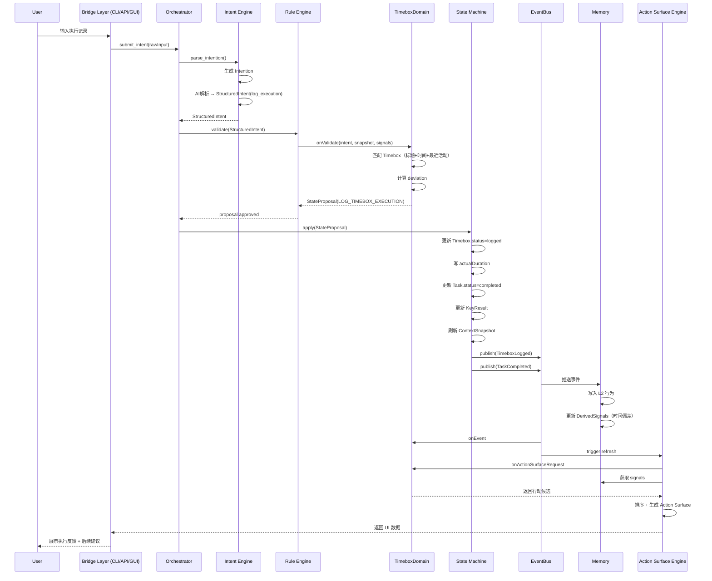
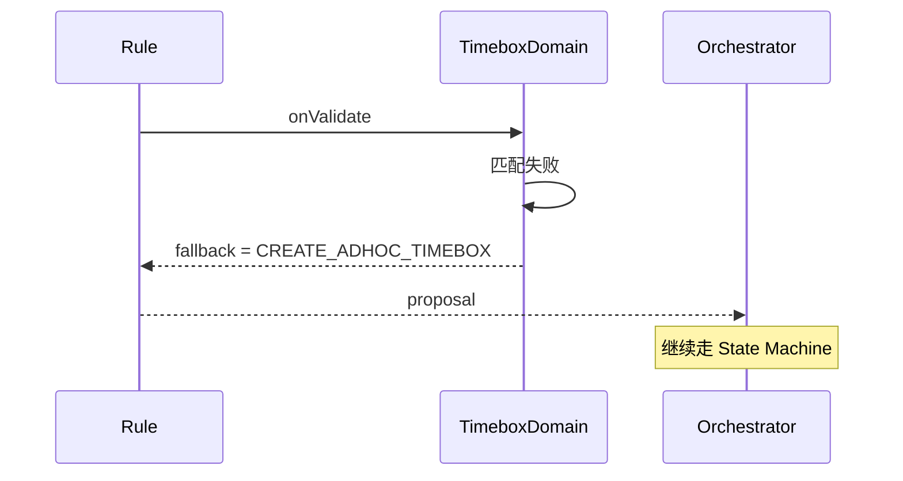
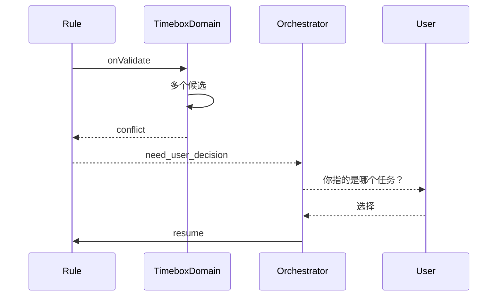
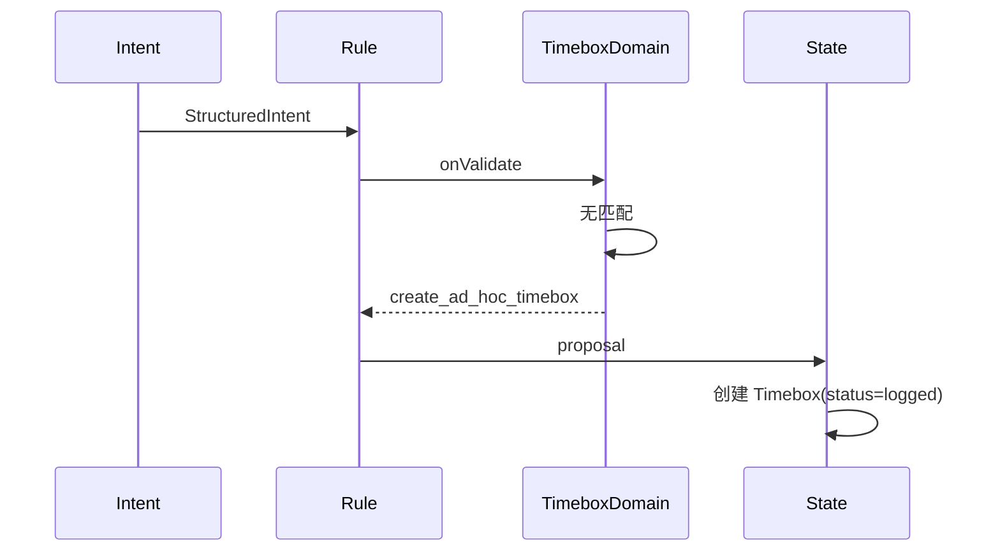
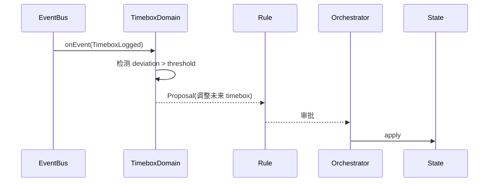

```
本文档用两个场景案例来验证 Nexus -> domain 的全过程是否能够顺利走通
```


------

# 🧠 场景设定一

> 用户输入一句话：
> 👉「明天上午9点，我要做2小时产品方案设计」

这是一个典型的**模糊但结构可推断的意图**。

------

## 一、入口：Intent Engine（唯一入口）

### 1️⃣ 原始输入 → Intention

系统先生成 USOM 对象：

```ts
Intention {
  rawInput: "明天上午9点，我要做2小时产品方案设计"
  status: "captured"
}
```

👉 此时还没有结构，只是“原材料”

------

### 2️⃣ Intent Engine 解析 → StructuredIntent

AI 或 fallback 表单解析为：


```ts
StructuredIntent {
  targetDomain: "timebox"
  action: "create_timebox"
  fields: {
    title: "产品方案设计",
    startTime: "2026-05-02T09:00:00",
    duration: 120
  },
  confidence: 0.87
}
```

👉 关键点：

- 这里只是**“建议做什么”**
- 没有任何状态变更

------

## 二、Orchestrator 启动链路

Orchestrator 不做判断，只做调度：

```
Intent Engine → Rule Engine → State Machine
```

👉 它是“流程总控”，不含业务逻辑

------

## 三、Rule Engine（决策层）

### 3️⃣ Domain.onValidate 被调用

Timebox Domain 接到：

```ts
onValidate(StructuredIntent, USOMSnapshot)
```

它检查：

#### ✔ 基本规则（确定性）

- 时间是否合法？
- duration 是否合理？
- 是否重叠？

#### ✔ 个性规则（来自 DerivedSignals）

- 用户是否在 morning peak？
- 最近是否过载？

👉 这里会用到 Memory Framework 的信号

------

### 4️⃣ 可能出现三种结果：

#### 情况 A：无冲突（通过）

生成：

```ts
StateProposal {
  type: "CREATE_TIMEBOX",
  payload: {...}
}
```

------

#### 情况 B：轻微冲突（自动调整）

比如：

👉 9点其实是低能量时段

可能变成：

```ts
建议改为 10:00
```

------

#### 情况 C：严重冲突（挂起）

比如：

👉 已有冲突时间盒

Orchestrator：

```
⛔ 挂起 → 等用户选择
```

------

## 四、State Machine（唯一写入口）

假设是 **情况 A（通过）**

------

### 5️⃣ 执行状态变更

State Machine：

```ts
创建 Timebox {
  status: "planned",
  startTime: 09:00,
  endTime: 11:00
}
```

👉 关键原则：

- 只有这里可以“写数据”
- Domain / AI 都不能写

------

### 6️⃣ 同步刷新 ContextSnapshot

```ts
ContextSnapshot {
  upcomingTimeboxes: [...新增这个时间盒]
}
```

👉 这是全系统“当前状态”

------

## 五、Event Bus（广播层）

### 7️⃣ 发布事件

```ts
Event: TimeboxCreated
```

------

## 六、Domain Plugin（被动响应）

各 Domain 收到事件：

------

### 8️⃣ Task Domain（例子）

可能做：

- 检查是否需要关联 Task
- 建议拆分任务

------

### 9️⃣ Habit Domain

- 无动作（忽略）

------

👉 注意：

- Domain **不能改状态**
- 只能“计算 + 提建议”

------

## 七、Memory Framework（记忆系统）

### 🔟 写入记忆

收到事件：

```ts
TimeboxCreated
```

Memory Framework：

- 写入 L2（行为记录）
- 更新 DerivedSignals

例如：

```ts
energyPattern.confidence += 0.01
```

👉 只有这里能写记忆

------

## 八、Action Surface Engine（唯一输出）

### 11️⃣ 生成行动切面

调用各 Domain：

```ts
onActionSurfaceRequest(snapshot, signals)
```

------

### 12️⃣ 返回候选行动

Timebox Domain 可能返回：

```ts
Dynamic Tile:
👉 "开始准备产品方案设计（明天 09:00）"
```

Task Domain 可能返回：

```ts
Continuity Cue:
👉 "你还没有拆分这个任务"
```

------

### 13️⃣ 排序 + 输出

最终形成：

```
Action Surface

[Action Guide]
👉 本周关键目标：完成产品方案

[Dynamic Tile]
👉 准备明天的时间盒

[Continuity Cue]
👉 未拆分任务
```

👉 这是用户看到的唯一界面输出

------

## 九、Bridge Layer（如果从 CLI / API 来）

如果这条输入来自 CLI：

```bash
lw intent "明天9点做方案设计2小时"
```

则：

```
CLI → REST API → StructuredIntent → Nexus
```

👉 完全同一条链路，无任何分叉

------

## 🔁 总结：一条链路的本质

把整个过程压缩成一句话：

> **输入的是“意图”，系统输出的是“下一步行动结构”，中间通过“状态机+规则+记忆”完成转化。**

------


## 思考

### ⚠️ 但有一个隐患

当前链路：

```
Intent → Rule → State → Event → Memory → Action
```

问题是：

> **Domain 的“建议能力”太弱，只能在 Action Surface 阶段发挥**

这会导致：

- Domain 更像“被动组件”
- 而不是“智能器官”

------

## 👉 一个升级建议（非必须，但很关键）

### 建议：增加一个“Domain Proposal 回流”

在 Event 后：

```
Domain.onEvent → 返回 Proposal（不是状态变更）
→ 再进入 Rule Engine 二次决策
```

这样：

👉 Domain 可以“主动推动系统”

否则你现在是：

👉 Nexus 决定一切，Domain 只是工具

------


# 🧠 场景设定二

> 用户输入一句话，是记录执行结果的意图：
> 👉「今天下午完成了会议部署，花了2小时」

------


## 1️⃣ Intent Engine

输入：

> “今天下午完成了会议部署，花了2小时”

------

### 生成 Intention

```
Intention {
  rawInput: "...",
  status: "captured"
}
```

------

### 解析为 StructuredIntent

```
StructuredIntent {
  targetDomain: "timebox"   // ⚠️ 关键选择
  action: "log_execution"
  fields: {
    title: "会议部署",
    actualDuration: 120,
    date: "2026-05-01",
    timeOfDay: "afternoon"
  }
}
```

👉 注意：

- 不是 create_timebox
- 而是 **log_execution（语义完全不同）**

------

## 2️⃣ Orchestrator 调度

进入标准链路：

```
Intent → Rule → State
```

------

## 3️⃣ Rule Engine（关键复杂点）

调用：

```
TimeboxDomain.onValidate(intent, snapshot, signals)
```

------

### 做三件关键事：

------

### ✔ ① 匹配已有 Timebox（核心逻辑）

在 snapshot 里找：

```
upcomingTimeboxes / 今日 timeboxes
```

匹配：

```
title ≈ "会议部署"
time ≈ 今天下午
```

👉 找到：

```
Timebox {
  start: 15:00
  end: 16:00
}
```

------

### ✔ ② 判断偏差（Deviation Analysis）

```
plannedDuration = 60
actualDuration = 120

deviation = +60
```

------

### ✔ ③ 决策类型

这里有三种可能：

------

#### 情况 A：找到唯一匹配 ✅

```
StateProposal {
  type: "LOG_TIMEBOX_EXECUTION",
  targetId: timebox.id,
  actualDuration: 120,
  deviation: +60
}
```

------

#### 情况 B：匹配多个（歧义）

👉 Orchestrator 挂起：

```
你是指哪个会议部署？
```

------

#### 情况 C：完全没匹配到

👉 转 fallback：

```
→ create ad-hoc execution record
```

（但仍然归 Timebox Domain）

------

## 4️⃣ State Machine（核心）

执行：

------

### ① 更新 Timebox

```
Timebox {
  status: "logged",
  actualDuration: 120,
  loggedAt: now
}
```

------

### ② 触发 Task 状态变更（如果关联）

```
Task {
  status: "completed"
  actualDuration: 120
}
```

------

### ③ 更新 KeyResult（如果有）

```
KeyResult.currentValue += 1
```

------

### ④ 刷新 ContextSnapshot

```
activeTasks 减少
completedTasks 增加
```

------

## 5️⃣ Event Bus

发出事件：

```
TimeboxLogged
TaskCompleted
```

------

## 6️⃣ Domain 响应

------

### Task Domain

- 更新统计
- 可能建议拆分未来任务

------

### Timebox Domain

- 记录 deviation pattern

------

## 7️⃣ Memory Framework（关键价值点）

写入：

------

### L2（事件）

```
会议部署执行耗时 2h
```

------

### DerivedSignals 更新：

```
executionAccuracy ↓
timeEstimationBias = +40%
```

👉 这会直接影响未来：

- Rule Engine（更严格）
- Action Surface（更保守排期）

------

## 8️⃣ Action Surface 输出

------

### Dynamic Tile（即时反馈）

```
✅ 已记录：会议部署（2小时）
```

------

### Continuity Cue

```
⚠️ 该任务耗时超预期，是否调整后续安排？
```

------

### Action Guide（可能变化）

```
👉 优先处理时间预估偏差问题
```


## 思考：这里真正的设计关键

------

### ⚠️ 核心不是 Domain，而是“匹配机制”

真正的问题是：

> **执行记录如何找到“它对应的对象”？**

这才是难点。

------

### 必须设计一个：

```
Execution Matching Strategy
```

至少包含：

1. 标题模糊匹配
2. 时间窗口匹配
3. 最近活动优先
4. 置信度评分

------

否则会出现：

```
用户说“刚刚做完那个任务”
→ 系统完全不知道是哪个 ❌
```


# 时序图

好，这里给你一张**工程级时序图（包含真实组件调用 + 数据流 + 分支）**，直接可以给开发用来实现。

我用 **Mermaid 时序图** 表达，结构已经按你当前架构拆清楚。

------

## 🧭 场景：执行记录（匹配已有 Timebox）

> 输入：
> “今天下午完成了会议部署，花了2小时”

------

##🧩 一、完整时序图（主路径：成功匹配）



------

## 🧨 二、关键分支（工程必须处理）

### 分支 1：匹配失败（找不到 Timebox）



👉 结果：

- 自动创建一个“事后 Timebox”
- 再执行 logged

------

### 分支 2：匹配冲突（多个候选）



👉 关键点：

- Orchestrator 负责“挂起/恢复”
- Rule 不直接交互用户

------

### 分支 3：无计划执行（现实常见）



👉 这一步很关键：

> **系统必须允许“现实先发生，计划后补”**

否则你这个系统会“脱离真实行为”。

------

## 🧠 三、这个链路的“结构亮点”

------

## ✅ 做对的地方（确定性）

### 1. 执行仍然走 Intent → Rule → State

👉 没开“快捷写入口”

这是对的：

```text
否则系统会变成：
现实数据污染系统状态 ❌
```

------

### 2. State Machine 仍然是唯一写入口

👉 即使是“记录”，也不是直接写 DB

这是操作系统级设计的核心

------

### 3. Memory 在事件之后

👉 不是在 Rule 阶段写

这保证：

```text
Memory = 事实沉淀
而不是决策输入污染
```

------

# ⚠️ 四、真正的复杂点

------

## ⚠️ 1. Execution Matching 是系统难点

你现在缺的是这个模块：

```text
Execution Matching Engine（隐式存在于 Domain）
```

如果不强化，会出现：

- 用户说“刚刚那个任务”
- 系统匹配错误
- 数据污染

👉 这是系统可信度的生死点

------

## ⚠️ 2. Deviation 没被提升为一等公民

现在只是：

```text
actualDuration ≠ plannedDuration
```

但你应该：

```text
Deviation = 可分析资产
```

否则：

👉 你做不出真正的“成长系统”

------

## ⚠️ 3. Domain 仍然是被动的

当前：

```text
Domain.onEvent → 只能算指标
```

问题：

👉 它不能“主动调整未来计划”

------

# 🧩 五、我给你的升级版（建议）

如果你要把这条链路做成“智能系统”，建议加这一段：

------

## 🔁 Domain Proposal 回流（关键升级）



------

👉 这会带来本质变化：

### 从：

```text
系统 = 被动记录
```

### 变成：

```text
系统 = 主动优化行为结构
```

------

# 🧱 最后总结（非常关键）

“执行记录链路”的本质：

> **不是记录行为，而是把“现实行为”重新纳入系统的时间结构。**

------

# 如果你下一步继续推进

我建议你做这三件事（优先级顺序）：

1. **设计 Execution Matching 算法（必须）**
2. **建模 Deviation（强烈建议）**
3. **做 Domain Proposal 回流（进阶能力）**

------

如果你愿意，我可以下一步直接帮你：

👉 设计一套
**“Execution Matching Engine（含置信度评分 + fallback策略）”**

这个东西会直接决定你产品是不是“像人一样理解行为”。


好，我来走完整个链路，然后画时序图。

------

**场景背景**

