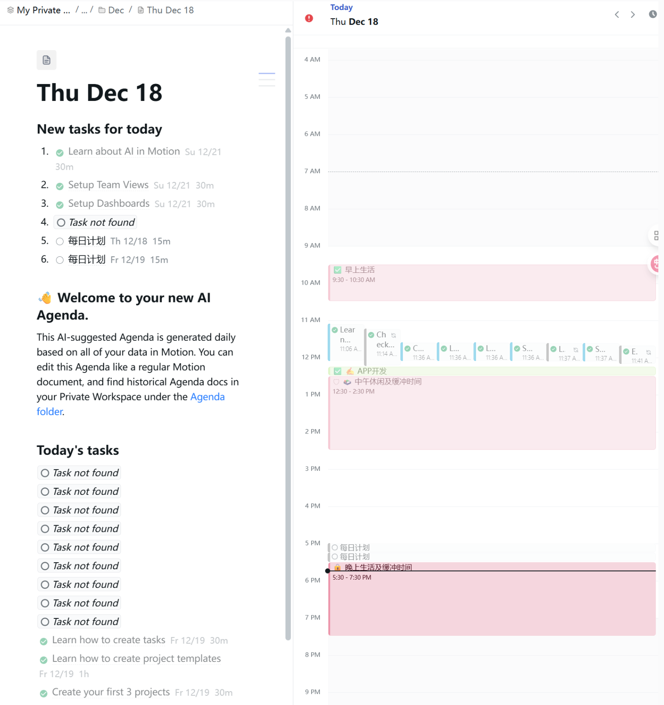
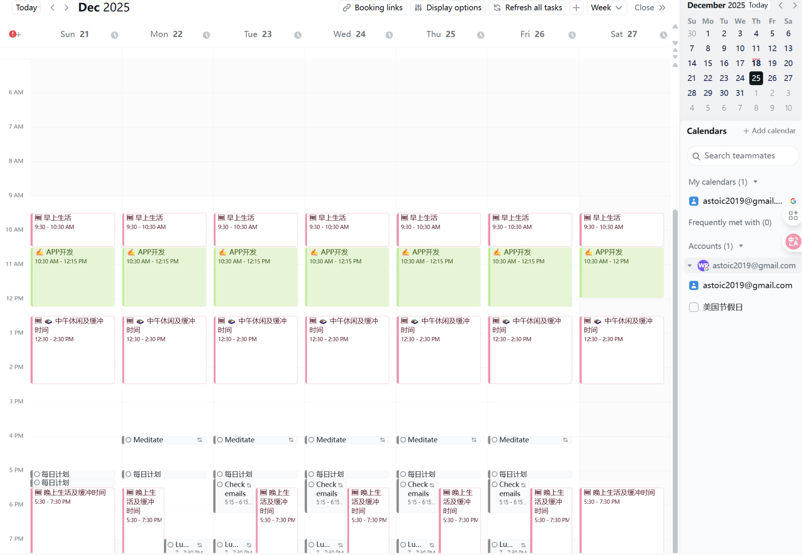
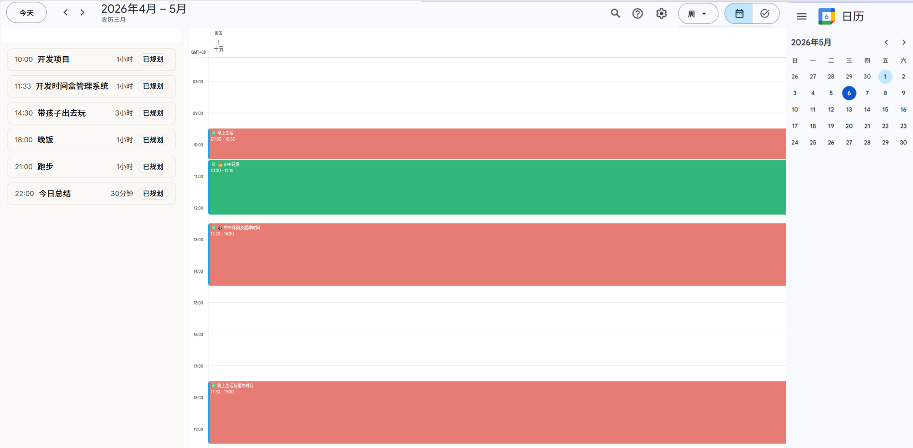
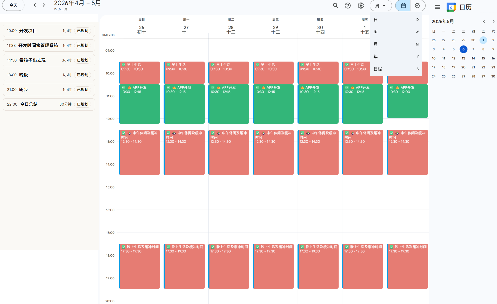
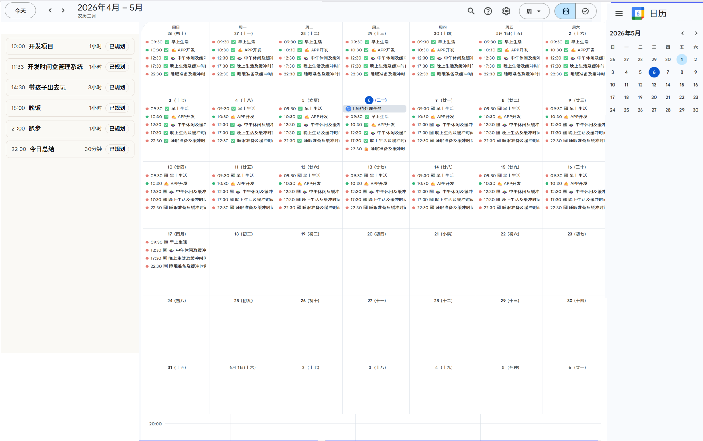

# 时间盒管理优化


```
本文档说明：
- 本文档是开发、迭代归档文件
- 本文档阅由开发者人工维护
- 本文档内容均已开发完成，作为备查资料
```


## [001] 对显示界面进行调整

### 状态

- [x] 已纳入开发
- 完成时间：2026.05.05

### 需求描述

- 磁贴位置显示在 MainContent 的上方

- 默认 MainContent 显示的内容

  - 可以几种显示方式

    - 1.左边显示时间盒列表，包括开始时间、时长、状态，title，右边显示可视化时间盒，如下图所示：

      

    - 2.日历模式：显示完整的日历组件，如下图所示
      


## [002] 关于详细日志的设计

### 状态

- [x] 已完成

- 完成时间：2026.05.05

### 需求描述

由于系统底层比较复杂，Nexus包括若干组件以及与 Domain 的协同，我需要在执行功能后查看系统详细的运行过程，为了便于调试和确认系统的正常运作，需要设计一个“详细运行日志”的功能，要求：

- 记录系统调用的所有组件，包括输入信息，输出信息
- 状态机发生变更，需要显示状态的所有信息
- “详细运行日志”功能可用一个配置参数开启或关闭


## [003] 默认主界面内容

### 状态

- [x] 已完成

- 完成时间：2026.05.06

### 需求描述

- 进入系统后，要能直接显示当天的时间盒

  

## [004] 时间盒的显示方式

### 状态

- [x] 已完成

- 完成时间：2026.05.06

### 需求描述

- 取消之前为“今日模式/日历模式”的显示方式

- 顶部：设置日期导航，日期模式分为“日/周/月”的模式，默认显示“日”，可以用前后选择按钮切换日期/周/月

- 左边：显示今天的时间盒列表

- 中间：显示日历时间

- 右边：显示日历

- 移动屏幕不支持“周“显示方式，只支持“日/月”模式

- 界面示例图：

  - 日视图

    

  - 周视图

    

  - 月视图

    


## [005] 时间盒执行开发

### 状态

- [x] 已完成

- 完成时间：2026.05.07

### 需求描述

当前的时间盒管理已经完成最基本的设置时间盒功能，现在需要完成时间盒时间事件的执行记录，请先帮我出一个需求规则，不清晰的找我澄清


## [006] 时间盒视图的调整

### 状态

- [x] 已完成

- 完成时间：2026.05.07

### 需求描述

- 由于时间盒视图（今日/周/月）都比较紧凑，考虑主内容界面可以直接拉伸至最宽，充分利用界面显示信息，这一点与Notion 的界面类似

- MVP阶段只考虑 Web端页面设计，移动端界面不再此阶段考虑


## [007] 时间盒界面主内容区的调整

### 状态

- [x] 未完成

- 完成时间：2026.05.07

### 需求描述

在当前plan中，对目标布局结构做一个调整，要求：

- AiPanel 并不是浮动定位，而是作为可收起模式，即有显示/收起两种形式，收起的时候，主内容区可以占1000%，显示的时候，主内容区自动减少宽度，默认是显示状态；
- 当前主内容区中，日视图、周视图、月视图并没有充分使用屏幕的宽度，导致内容显示比较拥挤。日视图的“时间盒”可以根据屏幕宽度，增加时间盒卡片的宽度，确保能显示更多的信息；周视图、月视图也可以充分利用宽度增大每天的格子宽度


##  [008] 时间盒卡片显示的修改

### 状态

- [x] 未完成

- 完成时间：2026.05.07

### 需求描述

- 显示可以分为两行，内容如下：
  - 第一行：[完成状态图标]  [开始时间]-[结束时间]   [title]  状态 操作，其中“完成状态图标”可以通过实心、半实心、空心来表示
  - 第二行：[Note小图标] [note]，只显示一行，如果note内容有换行，显示"\n "替代，如果宽度显示不下则截断。当鼠标移到[note] 上，可以浮动显示完整信息（带换行的），如果Note字段为空，不显示第二行
- 如果评分、能量不等于3，可以通过不同颜色来显示时间盒，具体方案你来设计


## [009] 关于AI助手生成时间盒计划的优化

### 状态

- [x] 未完成

- 完成时间：2026.05.07

### 需求描述

- 用户可能会一次性输入几个任务，例如用户输入“上午10:30-11:30 开会； 11:30-12:30 做周总结； 下午14:30-16:30 做市场调研”，那么应该可以识别成3个任务，并逐个处理。任务之间可能会是逗号、句号或其他分隔符，关键需要通过语义来识别提取。

