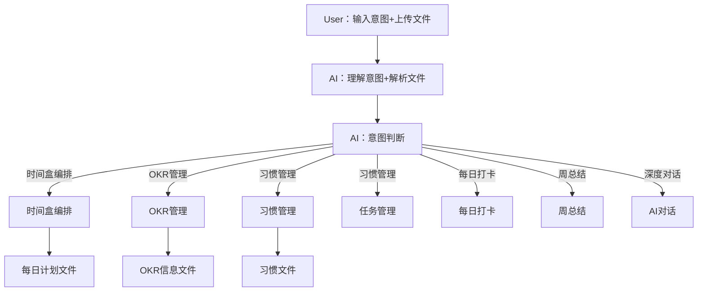

``` 
文档说明：
- 本文档描述当前正在做的待澄清需求
- AI需要通过读取该文档完成需求规划
- 状态为“已完成”的是已完成的内容，无需处理
- 由开发者人工来维护“状态”栏的内容
```


## [001] 时间盒智能编排

### 功能

Domain timebox action：

### 状态

- 完成时间：

### 现状

- 当前只能通过

### 需求内容

当前的AI助手主要是做计划，执行AI对话、表单填写双模式，使用体验效果一般，主要是

- AI 对话功能单调，无法回看
- 不满意时不好修改
- 表单填写功能单一，无法批量编辑


对AI助手的工作方式做一个重大改进，核心流程如下





