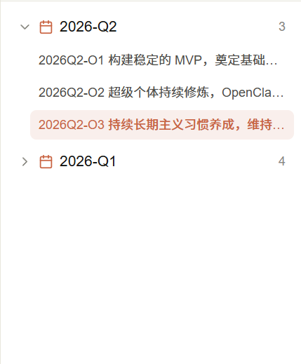

``` 
文档说明：
- 本文档描述当前正在做的待澄清需求
- AI需要通过读取该文档完成需求规划
- 状态为“已完成”的是已完成的内容，无需处理
- 由开发者人工来维护“状态”栏的内容
```


### [001] OKR模板完善

### 状态

- 完成时间：

### 需求描述

- OKR模板格式：模板缺少注释内容，模板未严格按照  @docs/superpowers/specs/2026-05-11-okr-import-design.md 模板的要求填上注释，注释的目的是让用户了解各字段的填写要求，在保存如数据库的时候过滤注释
- OKR 模板格式：模板支持多个Objective 的导入，所以模板内容需要可多设置一个Objective，用户容易理解


### [002] 优化OKR管理

### 状态

- 完成时间：

### 需求描述

- OKR管理界面：左边的OKR卡片列表形式改为树状形式，按照具体的周期分组（例如26Q1分一组，26Q2 分一组），只需要显示编号、目标即可，参照图示：

  


